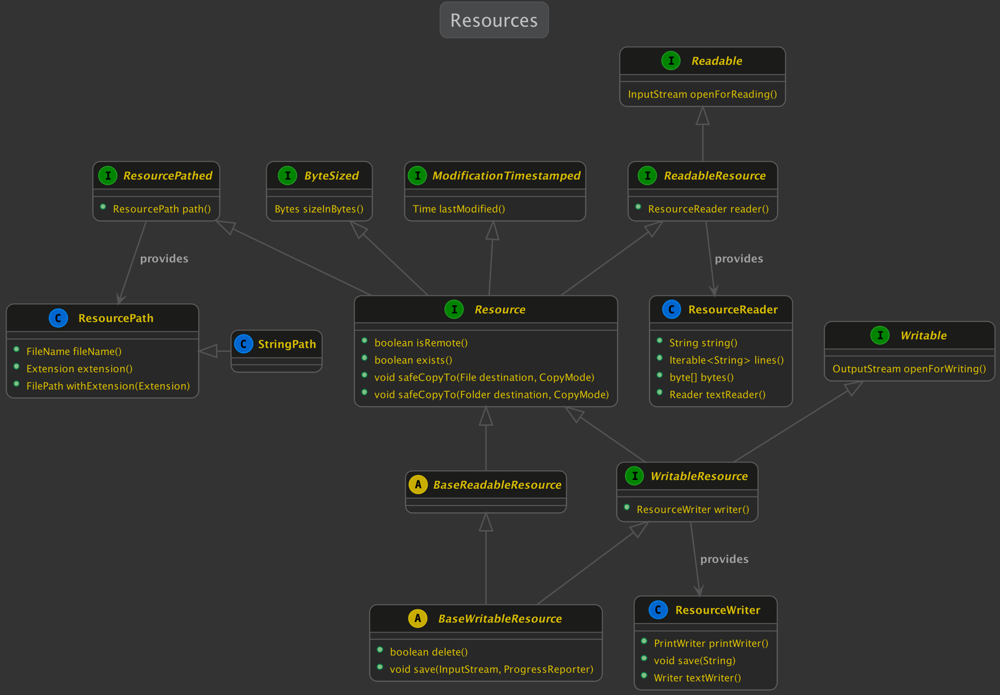
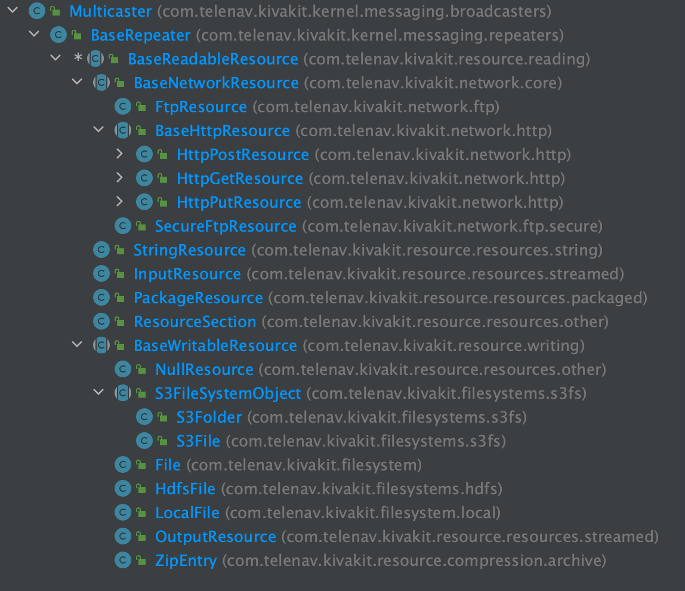

2021.08.24

### KivaKit resources &nbsp; 

A resource is a stream of data that can be opened, read from or written to, and then closed. KivaKit provides a resource mini-framework that allows easy and consistent access to many types of resources, and it makes it easy to create new resources. Examples of KivaKit resources include:

* Files
* Sockets
* Zip or JAR file entries
* S3 objects
* Package resources
* HDFS files
* HTTP responses
* Input streams
* Output streams

#### Example use cases

A few short examples of resource use cases:

*Read the lines of a .csv file from a package, reporting progress:*

    var resource = PackageResource.of(getClass(), "target-planets.csv");
    try (var line : listenTo(new CsvReader(resource, schema, ',', reporter)).lines())
    {
        [...]
    }

Note that if this code is in a KivaKit *Component*, then the first line can be reduced to:

    var resource = packageResource("target-planets.csv");

*Write a string to a file on S3:*

    var file = listenTo(File.parse("s3://mybucket/myobject.txt"));    
    try (var out = file.writer().printWriter())
    {
        out.println("Start Operation Impending Doom III in 10 seconds");
    }

*Safely extract an entry (ensuring no partial result) from a .zip file:*

    var file = listenTo(File.parse("/users/jonathan/input.zip"));
    var folder = listenTo(Folder.parse("/users/jonathan"));
    try (var zip = ZipArchive.open(file, reporter, READ))
    {
        listenTo(zip.entry("data.txt")).safeCopyTo(folder, OVERWRITE);
    }

In each case, the code is assumed to be present in a class implementing *Repeater*. The *listenTo()* calls add *this* as a listener to the argument object, creating a listener chain. If something notable happens in a *Resource* (for example, an attempt to open the resource when it doesn't exist), it will broadcast a message down the listener chain.

#### Resource problems and messaging

All *Resource*s inherit and use the *fatal()* method to report unrecoverable problems with opening, reading and writing (other methods may have different semantics, such as those with a boolean return value). The *fatal()* method in *Broadcaster*'s base interface *Transceiver* does two things:

1. Broadcasts a *FatalProblem* message to listeners
2. Throws an *IllegalStateException*

*This design decouples the broadcasting of a FatalProblem message to listeners from the flow-of-control change that occurs as the result of throwing an exception*. The result is that, in most cases, exceptions can be caught only when an operation is recoverable, and the information in the exception can usually be ignored because it has already been broadcast (and probably logged, depending on the terminal listener(s)).

For example, in this common (but unfortunate looking) idiom, error information is propagated to the caller with an exception that is caught, qualified with a cause, and logged:

    class Launcher
    {
        void doDangerousStuff()
        {
            [...]
            
            throw new DangerousStuffException("Whoops.");
        }
    }
     
    class AttackPlanet
    {
        boolean prepareMissileLauncher()
        {
            try
            {
                doDangerousStuff();
                return true;
            }
            catch (DangerousStuffException e)
            {
                LOGGER.problem(e, "Unable to do dangerous stuff");
                return false;
            }
        }
    }

One KivaKit alternative to this idiom is this:

    class Launcher extends BaseRepeater
    {
        void doDangerousStuff()
        {
            [...]
     
            fatal("Unable to do dangerous stuff: Whoops.");
        }
    }
    
    class AttackPlanet extends BaseRepeater
    {
        boolean prepareMissileLauncher()
        {    
            listenTo(new Launcher()).doDangerousStuff();
            return true;
        }
    }

After the *FatalProblem* message in *doDangerousStuff()* is broadcast by the *fatal()* method, the flow of control propagates separately via an *IllegalStateException* thrown by the same *fatal()* method to any caller on the call stack that might be able to substantially respond to the issue (as opposed to simply recording it). For more information, see [KivaKit messaging.](2021-07-07-broadcaster.md)

#### Design

Okay, so how do KivaKit resources work?

The design of KivaKit's resource module is [fairly complex](https://www.kivakit.org/0.9.8-beta/lexakai/kivakit/kivakit-resource/documentation/diagrams/diagram-resource.svg), so we will focus on the most important, high level aspects in this article.

A simplified UML diagram:

The *Resource* class in this diagram is central. This class:

* Has a *ResourcePath* (from *ResourcePathed*)
* Has a size in bytes (from *ByteSized*)
* Has a time of last modification (from *ModificationTimestamped*)
* Is a *ReadableResource*

Since all resources are *ReadableResource*s, they can be opened with *Readable.openForReading()*, or read from with the convenience methods in *ResourceReader* (which is accessed with *ReadableResource.reader()*).

In addition, some resources are *WritableResource*s. Those can be opened with *Writable.openForWriting()*, and written to with methods in the convenience class *ResourceWriter*

The *Resource* class itself can determine if the resource *exists()* and if it *isRemote()*. Remote resources can be *materialized* to a temporary file on the local filesystem before reading them (using methods not in the UML diagram). *Resource*s can also perform a safe copy of their contents to a destination *File* or *Folder* with the two *safeCopyTo()* methods. Safe copying involves 3 steps:

1. Write to a temporary file
2. Delete the destination file
3. Rename the temporary file to the destination filename

Finally, *BaseWritableResource* extends *BaseReadableResource* to add the ability to *delete* a resource, and to save an *InputStream* to the resource, reporting progress as it does this.

To give an idea of the resources that KivaKit provides this is a snapshot of the class hierarchy of readable and writable resources:

#### Implementing a resource

Now, let's take a quick look at a *Resource* implementation. The implementation of a simple *ReadableResource* requires only an *onOpenForReading* method and a *sizeInBytes()* method. A default for everything else will be provided by *BaseReadableResource*. The *StringResource* class is a good example. It looks like this:

    public class StringResource extends BaseReadableResource
    {
        private final String value;
    
        public StringResource(final ResourcePath path, final String value)
        {
            super(path);
            this.value = value;
        }
    
        @Override
        public InputStream onOpenForReading()
        {
            return new StringInput(value);
        }
    
            @Override
        public Bytes sizeInBytes()
        {
            return Bytes.bytes(value.length());
        }
    }

#### Conclusion

A few things we didn't talk about:

* All resources transparently implement different kinds of compression and decompression via the *Codec* interface
* The *ProgressReporter* interface and I/O progress
* Generic resource identifiers and their resolution
* The service provider interface (SPI) for *File* and *Folder*

#### Code

The resource module covered above is available in *kivakit-resource* in the [KivaKit](https://www.kivakit.org) project.

    <dependency>
        <groupId>com.telenav.kivakit</groupId>
        <artifactId>kivakit-resource</artifactId>
        <version>${kivakit.version}</version>
    </dependency>

 

Questions? Comments? Tweet yours to @OpenKivaKit or post here:

