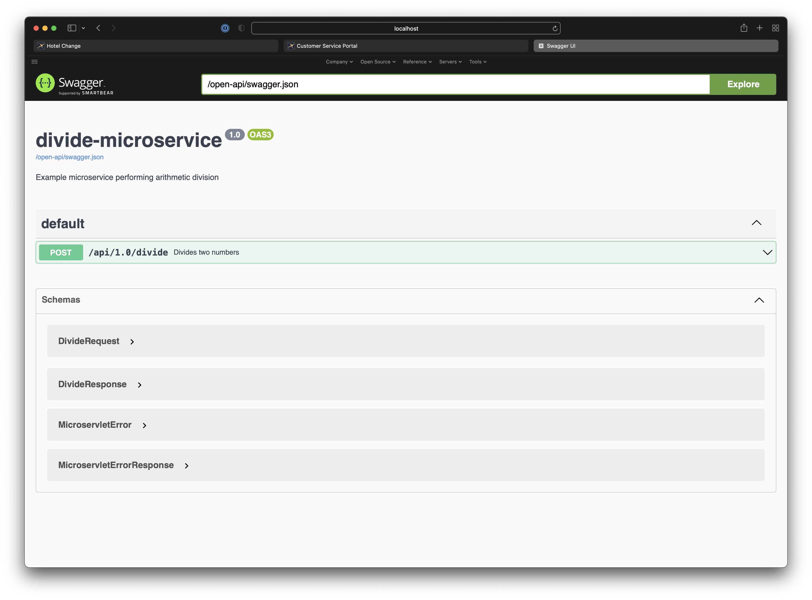

2021.10.01

### KivaKit Microservices &nbsp; 

KivaKit is designed to make coding microservices faster and easier. In this blog post, we will examine the new [*kivakit-microservice*](https://github.com/Telenav/kivakit-extensions/tree/develop/kivakit-microservice) module. As of this date, this module is only available for early access via SNAPSHOT builds and by [building KivaKit](https://github.com/Telenav/kivakit/blob/develop/documentation/overview/setup.md). The final release of this module should happen by the end of November, 2021 or sooner.

#### What does it do?

The *kivakit-microservice* mini-framework makes it easy to implement RESTful GET, POST and DELETE handlers, and to *mount* those handlers on specific paths. Most of the usually plumbing is taken care of, including integration with the Jetty web server. In addition, *kivakit-microservice* provides support for a limited subset of the OpenAPI specification through Swagger integration. Finally, KivaKit provides a simple integration with Apache Wicket. Given these features, *kivakit-microservice* supports:

* Mounting of GET, POST and DELETE HTTP request handlers
* Error handling via KivaKit [messaging](2021-07-07-broadcaster.md)
* Gson serialization
* Configuration and startup of Jetty server
* Swagger OpenAPI specification viewing
* Apache Wicket web interface

#### Microservices

The *Microservice* class is an *Application* which provides automatic configuration and startup of Jetty server. For example:

    public class DivisionMicroservice extends Microservice
    {
        public static void main(final String[] arguments)
        {
            new DivisionMicroservice().run(arguments);
        }
    
        @Override
        public MicroserviceMetadata metadata()
        {
            return new MicroserviceMetadata()
                    .withName("divide-microservice")
                    .withDescription("Example microservice performing arithmetic division")
                    .withVersion(Version.parse("1.0"));
        }
    
        @Override
        public void onInitialize()
        {
            // Register components here 
        } 
            
        public DivideRestApplication restApplication()
        {
            return new DivideRestApplication(this);
        }
    }

The *main()* method of this microservice creates an instance of *DivisionMicroservice* and starts it running with a call to *run(String[])*, the same as with any KivaKit application. The *metadata()* method returns information about the service that will be included in the REST OpenAPI specification. The *restApplication()* factory method creates a REST application for the microservice, and the *webApplication* factory method optionally creates an Apache Wicket web application for configuring the service and viewing its status. Any initialization of the microservice takes place the *onInitialize()* method. This is usually the best place to [register components](2021-06-23-service-locator.md) used elsewhere in the application. 

When the *run(String[] arguments)* method is called, a microservice configures and starts Jetty server on the port specified by the *MicroserviceSettings* object loaded by the [*-deployment* switch](2021-09-07-deployment.md). However, the *-port* command line switch can be used to override this value. When the microservice starts, the following resources are automatically added to Jetty server:

| Resource Path          | Description                           |
|------------------------|---------------------------------------|
| /                      | Apache Wicket web application         |
| /                      | KivaKit microservlet REST application |
| /assets                | Static resources                      |
| /docs                  | Swagger OpenAPI documentation         |
| /open-api/assets       | OpenAPI resources (.yaml files)       |
| /open-api/swagger.json | OpenAPI specification                 |
| /swagger/webapp        | Swagger web application               |
| /swagger/webjar        | Swagger design resources              |

#### REST Applications

A REST application in *kivakit-microservice* is created by extending the *MicroserviceRestApplication* class:

public class DivideRestApplication extends MicroserviceRestApplication
{
    /**
     * Construct and mount requests
     */
    public DivideRestApplication(Microservice microservice)
    {
        super(microservice);
    }
    
    @Override
    public void onInitialize()
    {
        mount("divide", DivideRequest.class);
    }
}

The *onInitialize()* method above is used to mount request handlers on specific paths. If the mount path (in this case "divide") doesn't begin with a slash ("/"), the path "/api/[major-version].[minor-version]/" is prepended automatically. So, "divide" becomes "/api/0.9/divide", where the version *0.9* comes from the metadata returned by *MyMicroservice*. The *same path* can be used to mount a request handler for each HTTP method (GET, POST, DELETE). However, trying to mount two handlers for the same HTTP method on the same path will result in an error.

The *gsonFactory()* factory method (not shown) can optionally provide a factory that creates configured *Gson* objects. The *Gson* factory should extend the class *MicroserviceRestApplicationGsonFactory*. KivaKit will use this factory when serializing and deserializing JSON objects.

The exact flow of control that occurs when a request is made to a KivaKit microservice, is detailed in the Javadoc for [*MicroserviceRestApplication*](https://github.com/Telenav/kivakit-extensions/blob/develop/kivakit-microservice/src/main/java/com/telenav/kivakit/microservice/rest/MicroserviceRestApplication.java).

#### Request Handlers

The request handlers that are mounted on a *MicroserviceRestApplication* with calls to *mount(String path, Class handler)* come in three flavors, each of which is a subclass of *MicroserviceRequest*:

* MicroservletGetRequest
* MicroservletPostRequest
* MicroservletDeleteRequest

Below, we have a POST request handler, *DivideRequest*, that divides to numbers. The response is provided by the nested class *DivideResponse*. In addition, an OpenAPI specification is generated by the framework using information from the *@OpenApi* annotations. The request also performs validation by implementing the *Validatable* interface required by *MicroservletPostRequest*:

    @OpenApiIncludeType(description = "Request for divisive action")
    public class DivideRequest extends MicroservletPostRequest
    {
        @OpenApiIncludeType(description = "Response to a divide request")
        public class DivideResponse extends MicroservletResponse
        {
            @Expose
            @OpenApiIncludeMember(description = "The result of dividing",
                                  example = "42")
            int quotient;
    
            public DivideResponse()
            {
                this.quotient = dividend / divisor;
            }
    
            public String toString()
            {
                return Integer.toString(quotient);
            }
        }
    
        @Expose
        @OpenApiIncludeMember(description = "The number to be divided",
                              example = "84")
        private int dividend;
    
        @Expose
        @OpenApiIncludeMember(description = "The number to divide the dividend by",
                              example = "2")
        private int divisor;
    
        public DivideRequest(int dividend, int divisor)
        {
            this.dividend = dividend;
            this.divisor = divisor;
        }
    
        public DivideRequest()
        {
        }
    
        @Override
        @OpenApiRequestHandler(summary = "Divides two numbers")
        public DivideResponse onPost()
        {
            return listenTo(new DivideResponse());
        }
    
        @Override
        public Class<DivideResponse> responseType()
        {
            return DivideResponse.class;
        }
    
        @Override
        public Validator validator(ValidationType type)
        {
            return new BaseValidator()
            {
                @Override
                protected void onValidate()
                {
                    problemIf(divisor == 0, "Cannot divide by zero");
                }
            };
        }
    }

Notice that the nested response class uses the outer class to access the request's fields. This makes [getters and setters](https://www.infoworld.com/article/2073723/why-getter-and-setter-methods-are-evil.html) unnecessary. When *onPost()* is called by KivaKit, the response object is created (and any messages it produces will be repeated due to the call to *listenTo()*) and the constructor for that object performs the divide operation.

#### Accessing KivaKit Microservices in Java

The *kivakit-microservice* module includes *MicroserviceClient*, which provides easy access to KivaKit microservices in Java. The client can be used like this:

    public class DivisionClient extends Application
    {
        public static void main(String[] arguments)
        {
            new DivisionClient().run(arguments);
        }
    
        @Override
        protected void onRun()
        {
            // Create a client to talk to the DivideMicroservice REST API,
            var client = listenTo(new MicroservletClient(
                    new MicroserviceRestApplicationGsonFactory(), 8086, Version.parse("1.0"));
    
            // then issue a divide request, read the response,
            var request = new DivideRequest(9, 3);
            var response = client.post("/api/1.0/divide", DivideRequest.DivideResponse.class, request);
    
            // and show the response.
            Message.println(AsciiArt.box("response => $", response));
        }
    }

Here, we get the port of the microservice

#### OpenAPI

The "/docs" path on the server provides a generated OpenAPI specification via Swagger:

#### Code

The code discussed above is a [working example](https://github.com/Telenav/kivakit-examples/tree/develop/kivakit-examples-microservice) in the *kivakit-examples* repository. It can be instructive to trace through the code in a debugger.

The KivaKit Microservice API is available for early access in the *develop* branch of the [*kivakit-microservice*](https://github.com/Telenav/kivakit-extensions/tree/develop/kivakit-microservice) module of the *kivakit-extensions* repository in [KivaKit](https://www.kivakit.org).

    <dependency>
        <groupId>com.telenav.kivakit</groupId>
        <artifactId>kivakit-microservice</artifactId>
        <version>${kivakit.version}</version>
    </dependency>

 

Questions? Comments? Tweet yours to @OpenKivaKit or post here:

