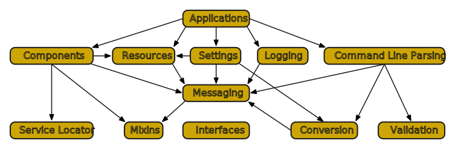

# Introducing KivaKit

[KivaKit](https://www.kivakit.org) is a modular Java application framework designed to make development of microservices quicker and easier. It has been developed at [Telenav](https://www.telenav.com) since 2011, and is now available as an Apache Licensed, Open Source project on [GitHub](https://github.com/Telenav/kivakit). In this article, we will explore the design of KivaKit as a collection of "mini-frameworks" that work together, and provide an overview of the functionality in KivaKit modules.

## Online Resources

| Resource     |     Description                   |
|--------------|-----------------------------------|
| *Setup* | [Developer setup](https://github.com/Telenav/kivakit/blob/master/documentation/overview/setup.md)|
| *GitHub* | [GitHub repository](https://github.com/Telenav/kivakit) |
| *Project Lead* | Jonathan Locke (Luo, Shibo)   [jonathanl@telenav.com](mailto:jonathanl@telenav.com) |
| *Blog* | https://state-of-the-art.org/ |
| *Chat* | [Zulip](https://kivakit.zulip.com) |
| *Twitter* | [@OpenKivaKit](https://twitter.com/openkivakit) |

## Installing and building KivaKit

KivaKit targets a Java 11 or higher virtual machine (but can be used from Java 8 source code). Artifacts for all KivaKit modules are available on [Maven Central](https://search.maven.org). 

To clone and build KivaKit, we will follow these steps:

1. Install Git, [Git Flow](https://www.atlassian.com/git/tutorials/comparing-workflows/gitflow-workflow), [Java 16 JDK](https://adoptopenjdk.net/?variant=openjdk16&jvmVariant=hotspot), and [Maven 3.8.1 or higher](https://maven.apache.org/download.cgi).

1. Clone the *kivakit* repository into our workspace:

	    mkdir ~/Workspace
	    cd ~/Workspace
	    git clone https://github.com/Telenav/kivakit.git

1. Copy the sample bash profile to our home folder:

	    cp kivakit/setup/profile ~/.profile

1. Modify it to point to our Workspace, and our Java and Maven installations:

	    export KIVAKIT_WORKSPACE=$HOME/Workspace
	    export JAVA_HOME=/Library/Java/JavaVirtualMachines/jdk-16.0.2.jdk/Contents/Home 
	    export M2_HOME=$HOME/Developer/apache-maven-3.6.3

1. Ensure that we are running *bash* (on MacOS, *zsh* is the default now):

	    chsh -s /bin/bash

1. *Restart our terminal program*, and execute:

	    $KIVAKIT_HOME/setup/setup.sh

The setup script will clone some related repositories, initialize git flow and build all relevant projects.

## KivaKit Modules and Mini-frameworks

KivaKit 1.0 contains 54 modules, including the add-on modules in the *kivakit-extensions* repository. This may seem daunting, but we can pick and choose what we want to include in our projects since each module in KivaKit is designed to be used on its own. 

Some KivaKit modules contain *mini-frameworks*. A mini-framework provides a simple, abstract design, using broadly applicable interfaces, to address some common problem. These small frameworks are carefully integrated so that they will work together smoothly.

Here are the key areas of functionality provided by KivaKit mini-frameworks:

| Mini-framework | Module | Description |
|----------------|-------------|
| Application | kivakit-application | Base components for applications and servers |
| Command Line Parsing | kivakit-commandline | Switch and argument parsing using the conversion and validation mini-frameworks |
| Component | kivakit-component | Base functionality for implementing KivaKit components, including applications |
| Conversion | kivakit-kernel | An abstraction for implementing robust, modular type converters |
| Extraction | kivakit-kernel | Extraction of data from a source |
| Interfaces | kivakit-kernel | Generic interfaces used as integration points between frameworks | 
| Logging | kivakit-kernel kivakit-logs-\* | Core logging functionality, log service provider interface (SPI) and log implementations |
| Messaging | kivakit-kernel | Enables components to transmit and receive status information |
| Mixins | kivakit-kernel | An implementation of stateful [traits](https://en.wikipedia.org/wiki/Trait_(computer_programming)) |
| Resource | kivakit-resource kivakit-network-\* kivakit-filesystems-\* | A abstraction for streamed resources |
| Service Locator | *kivakit-configuration* | An implementation of the [service locator pattern](https://martinfowler.com/articles/injection.html) for finding components and settings information |
| Settings | kivakit-configuration | Provides easy access to component configuration information |
| Validation | kivakit-validation | Base functionality for checking the consistency of objects |

All of these frameworks can be found in the *kivakit* repository, while some less important modules like service providers are located in *kivakit-extensions*.

## Messaging

As the diagram above shows, messaging is a central integration point for most of the mini-frameworks in KivaKit. Messaging formalizes status reporting. Failures that are normally logged or provided through return values or exceptions are instead broadcast as messages to interested listeners.

This design allows components to focus on reporting status without being concerned with what is done with their status. The information may be sent to a logger, included in a statistic, or displayed to an end user. The component doesn't care. It just reports the issue.

KivaKit components that broadcast status information can be connected to a one or more listeners, often forming a *listener chain*:

In KivaKit, the *Application* component is normally the termination point for listener chains and it logs the messages it receives. But along the way, components may have other uses for these messages.

## Mixins

Another integration feature of KivaKit is the *mixins* mini-framework. It provides functionality that allows base classes in KivaKit to also be provided through interfaces as ["stateful traits"](https://en.wikipedia.org/wiki/Trait_(computer_programming)).

For example, the *BaseComponent* class in KivaKit provides functionality for  building components that send and receive messages, access resources and settings, and perform other common tasks. In Java, a class that already has a base class cannot extend *BaseComponent*. KivaKit mixins allow *BaseComponent* functionality to be applied to a component that already has a base class, like this:

    public class MyComponent extends MyBaseClass implements ComponentMixin
    {
        [...]
    }

The interface *ComponentMixin* extends *Mixin*, which instantiates an instance of *BaseComponent* and associates it with *MyComponent*. *ComponentMixin* then uses Java default methods to access this state and implement the methods described by the *Component* interface. By doing this, the same methods are available to a component implementing *ComponentMixin* that would be present if *MyComponent* extended *BaseComponent*.

## Service Locator

The service locator class *Registry* provides us a way to wire components together. Although it provides roughly the same functionality as *dependency injection*, it is different in one important way. In the service locator pattern, components reach out for the interfaces that they need rather than having them pushed to the component by external configuration. This subtly affects dependency scoping and encapsulation because the service locator pattern can be used within a method, such as:

    public void save() 
    {
        var database = require(Database.class);
        database.save(this);
    }
    
When this method returns, the acquired reference to the *Database* service leaves scope, ensuring that no outside code can obtain the reference and that it will be eligible to be freed by the garbage collector.

## Resources and Filesystems

The *kivakit-resource* module provides abstractions for reading (*Resource*) and writing (*WritableResource*) streamed resources, and accessing filesystems. A few of the more important resource types that KivaKit supports include:

 * Files (local, Zip, S3 and HDFS)
 * Package resources
 * Network protocols (sockets, HTTP, HTTPS and FTP)
 * Input and output streams

The benefits of this abstraction are:

1. Consistent API for all resources
2. Interfaces allow generic access to unknown resource types

## Components

The *kivakit-component* module provides ready access to functionality that is commonly required in components:

* Sending and receiving of messages
* Access to relative packages and packaged resources
* Registration and lookup of objects, components and settings

The *Component* interface is implemented by *BaseComponent* and *ComponentMixin*, allowing "component nature" to be added to any object.

## Logging

Listener chains formed by *KivaKit* components often terminate in a *Logger* (which is a *Listener*) that writes to one or more *Log*s. The *kivakit-kernel* module provides an SPI for implementing *Log*s, including:

| Provider | Module |
|----------|--------|
| ConsoleLog | kivakit-kernel |
| FileLog | kivakit-logs-file |
| EmailLog | kivakit-logs-email |

One or more log implementations can be selected and configured from the command line with the *KIVAKIT_LOG* property.

## Conversion and Validation

The *kivakit-kernel* module contains mini-frameworks for type conversion and object validation. These frameworks are integrated with KivaKit messaging and handle common error conditions in a consistent way. Type converters just need implement the conversion code and don't need to worry about exceptions, empty strings or null values. Messages broadcast by *Validatable*s are captured by the validation mini-framework and analyzed to provide clients with easy access to statistics and descriptions of malformed objects.

## Applications, Command Lines and Settings

The *kivakit-application*, *kivakit-configuration* and *kivakit-commandline* modules pull together the mini-frameworks discussed above to provide a simple, consistent model for developing applications. In KivaKit, an application is a *Component* and inherits all the functionality in that interface.

The *kivakit-configuration* project uses the *kivakit-resource* module to load settings information for components from *.properties* files (and other sources in the future). It converts these resources to objects using *kivakit-kernel* converters, and validates them with the validation *mini-framework*. 

The command line for an application is parsed by the *kivakit-commandline* module using converters and validators. Issues that arise are presented to the user through the application's console logger.

## Microservices

So far we've discussed KivaKit features that are generally useful to any application. KivaKit also provides functionality in *kivakit-extensions* that is targeted specifically at microservices. 

The *kivakit-web* project contains modules for rapidly developing a simple REST and web interface to a microservice. The *JettyServer* class provides a simple abstraction for programmatically plugging in simple servlets and filters with a minimum of hassle. Plugins for this class include:

| Plugin | Description |
|--------|-------------|
| JettyJersey | REST application support |
| JettySwagger | Swagger automatic REST documentation |
| JettyWicket | Support for the Apache Wicket web framework |

These plugins can be combined with a small amount of code to provide a RESTful microservice with Swagger documentation and a web interface:

    var application = new MyRestApplication();
    listenTo(new JettyServer())
        .port(8080)
        .add("/*",          new JettyWicket(MyWebApplication.class))
        .add("/open-api/*", new JettySwaggerOpenApi(application))
        .add("/docs/*",     new JettySwaggerIndex(port))
        .add("/webapp/*",   new JettySwaggerStaticResources())
        .add("/webjar/*",   new JettySwaggerWebJar(application))
        .add("/*",          new JettyJersey(application))
        .start();

KivaKit 1.1 will include a dedicated microservices module that will make microservices even easier to create.

## Documentation and Lexakai

The documentation for KivaKit is generated by [Lexakai](https://www.lexakai.org), which is an open source project distributed under Apache License and based on KivaKit. 

Lexakai creates UML diagrams (guided by annotations when desired) and updates README.md markdown files with common header and footer information as well as indexes of the generated UML diagrams and Javadoc documentation.

## Conclusion

In this article, we took a look at the design of KivaKit and the functionality it provides through modules and mini-frameworks. KivaKit is ideally suited for developing microservices and has been designed to be learned and used in easy-to-digest, independent pieces.
