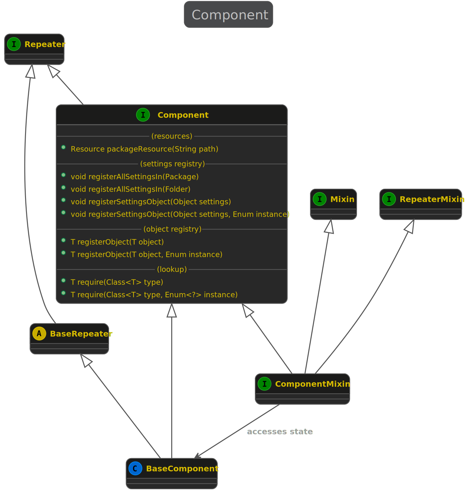
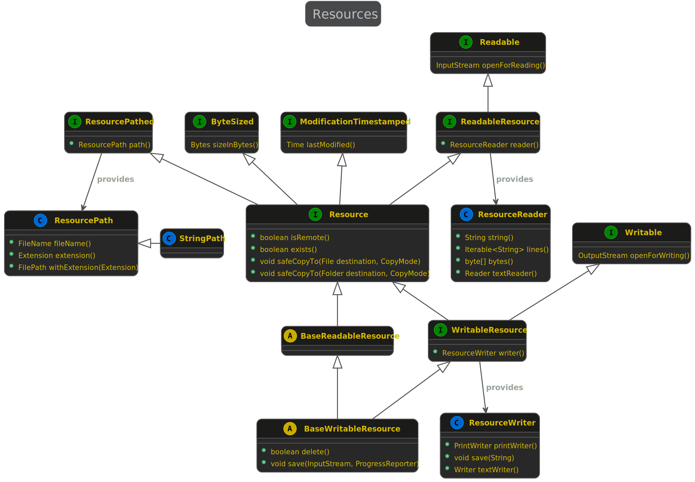
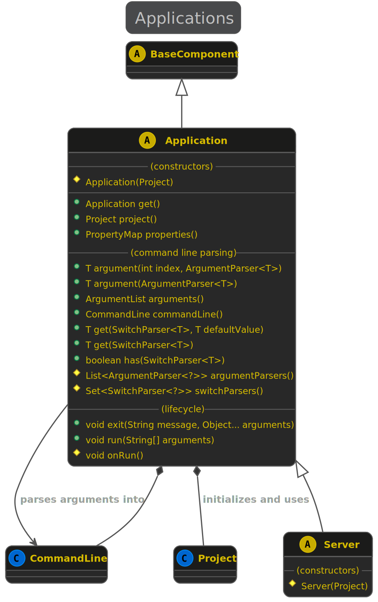
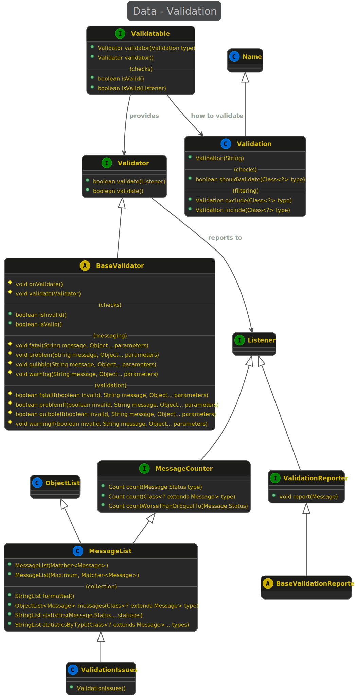
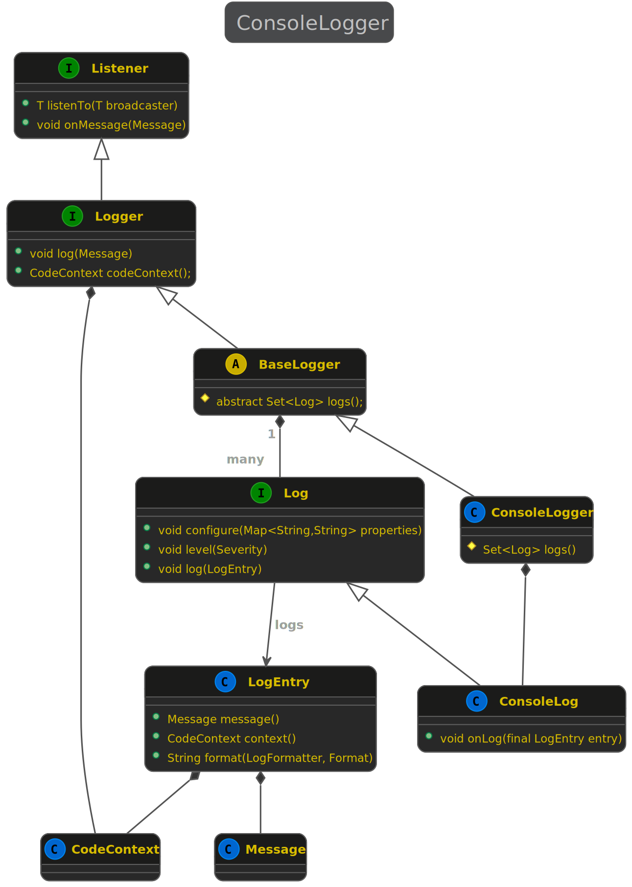

# The KivaKit Framework

Jonathan Locke  
September 2021

KivaKit is an Apache License open source framework ideal for implementing [microservices](https://martinfowler.com/articles/microservices.html). KivaKit is composed of a set of carefully integrated *mini-frameworks*. Each mini-framework has a consistent design and its own focus, and can be used in concert with other mini-frameworks or on its own. A simplified dependency network of these frameworks provides a good high level view of KivaKit:

Each mini-framework addresses a different issue that is commonly encountered when developing microservices. This article provides a brief overview of the mini-frameworks in the diagram above, and a sketch of how they can be used.

## Messaging

As we can see in the diagram above, messaging is central to KivaKit. Messaging is useful in building components whose status is *observable*, which is a helpful feature in a cloud-based world. Many objects in KivaKit broadcast or listen to status *Message*s such as *Alert*, *Problem*, *Warning* or *Trace*. Most are *Repeater*s, listening for status messages from other object(s) and re-broadcasting them to interested listeners downstream. This forms a *listener chain* with a terminal *Listener*:

    C -> B -> A

Often, the final listener in a chain is some kind of *Logger*, but there can be multiple listeners at the end of the chain as well, and any object implementing *Listener* will work. For example, in the *validation* mini-framework, status messages are captured by the *ValidationIssues* class, which is then used to determine if validation succeeded or not, as well as to present specific problems from a validation failure to a user.

Given the listener chain above, C and B implement *Repeater* and the final object A implements *Listener*. Within each class in the chain, the listener chain is extended with:

    listener.listenTo(broadcaster)

To transmit a message to interested listener(s), convenience methods are inherited from *Broadcaster* for common types of messages:

| Message | Purpose |
|---|---|
| problem() | Something has gone wrong and needs to be addressed, but it's not fatal to the current operation. |
| glitch() | A minor problem has occurred. Unlike a Warning, a Glitch indicates validation failure or data loss has occurred. Unlike a Problem, a Glitch indicates that the operation will definitely recover and continue. |
| warning() | A minor issue has occurred which should be corrected, but does not necessarily require attention. |
| quibble() | A trivial issue has occurred that does not require correction. |
| announcement() | Announces of an important phase of an operation. |
| narration() | A step in some operation has started or completed. |
| information() | Commonly useful information that doesn't represent any problem .|
| trace() | Diagnostic information for use when debugging. |

*Broadcaster* also provides a mechanism for switching *Trace* messages on and off from the command line by pattern matching against classes and packages.

## Mixins

In KivaKit, there are two ways to implement *Repeater*. The first is by simply extending *BaseRepeater*. The second is to use a stateful trait or *Mixin*. Implementing the *RepeaterMixin* interface is the same as extending *BaseRepeater*, but the repeater mixin can be used in a class that already has a base class. Note that the same pattern is used for the *Component* interface discussed below. If it's not possible to extend *BaseComponent* then *ComponentMixin* can be implemented instead.

The *Mixin* interface provides a workaround for a missing Java language feature. It works by delegating state lookup to a package private class, *MixinState*, which uses the *this* reference of the class implementing *Mixin* to look up an associated state object in an identity hash map. The *Mixin* interface looks like this:

    public interface Mixin
    {
        default <T> T state(Class<? extends Mixin> type, Factory<T> factory)
        {
            return MixinState.get(this, type, factory);
        }
    }

If the state object for *this* is not found by *state()*, the given factory method will be used to create a new state object, which will then be associated with the mixin in the state map. For example, our *RepeaterMixin* interface looks roughly like this (without most of the methods for the sake of brevity):

    public interface RepeaterMixin extends Repeater, Mixin
    {
        @Override
        default void addListener(Listener listener, Filter<Transmittable> filter)
        {
            repeater().addListener(listener, filter);
        }    
            
        @Override
        default void removeListener(Listener listener)
        {
            repeater().removeListener(listener);
        }
    
        [...]
        
        default Repeater repeater()
        {
            return state(RepeaterMixin.class, BaseRepeater::new);
        }        
    }

Here, the *addListener()* and *removeListener()* methods each retrieve their *BaseRepeater* state object through *repeater()* and delegate the method call to that object. As we can see, it's not very complicated to implement a mixin in KivaKit.

> It should be noted that each call to a method in a mixin will require a lookup in the state map. An identity hash map should be fairly efficient in general, but for a few components this could be a performance problem. As with most performance problems, it's best for us to do the simplest thing until our profiler says otherwise.

## Components

A KivaKit *Component* might commonly be a key part of a microservice. Components provide easy access to messaging either through extension of *BaseComponent* (the most common case) or by implementing *ComponentMixin*. Inheriting from *Component* adds no state at all to an object except for the list of listeners inherited from *Repeater*. This makes components very lightweight. It is not a problem to instantiate large numbers of them. Since *Component*s are *Repeater*s, listener chains can be created, as described above.

In addition to providing convenient access to messaging, components also provide functionality to:

 * Register and lookup objects
 * Load and access settings objects 
 * Access package resources 

Let's take a look at each of these facilities.

### Object Registration and Lookup

KivaKit uses the [*service locator*](https://martinfowler.com/articles/injection.html) design pattern instead of dependency injection. The use of this pattern in a *Component* is simple. One component can register an object with *registerObject()* and another component can look it up with *require()*:

    Database database = [...]
    registerObject(database);
    
    [...]
    
    var database = require(Database.class);

If multiple instances of a single class need to be registered, an *enum* value can be used to distinguish them:

    enum Database { PRODUCTS, SERVICES }

    registerObject(database, Database.PRODUCTS);
    
    [...]
    
    var database = require(Database.class, Database.SERVICES);

In KivaKit, anywhere we might have used dependency injection we use *register* and *require* instead.

### Settings

Components in KivaKit can also readily access settings information with the *require()* method:

    require(DatabaseSettings.class);

As with registered objects, an enum can be used to distinguish between settings objects in the event that there is more than one of the same type:

    require(DatabaseSettings.class, Database.PRODUCTS);

Settings information can be registered in several ways:

    registerAllSettingsIn(Folder)
    registerAllSettingsIn(Package)
    registerSettingsObject(Object)
    registerSettingsObject(Object, Enum)

In KivaKit 1.0, settings objects loaded with the *registerAllSettingsIn()* methods are defined by *.properties* files. In the future, an API will be provided to allow properties to be loaded from other sources, such as .json files. The name of the settings class to instantiate is given by the *class* property. Individual properties of the instantiated object are then retrieved from the remaining properties. Each property is converted to an object using a KivaKit converter (described below).

For example:

#### DatabaseSettings.properties

    class = com.mycompany.database.DatabaseSettings
    port  = database.production.mypna.com:3306

#### DatabaseSettings.java

    public class DatabaseSettings
    {    
        @KivaKitPropertyConverter(Port.Converter.class)
        private Port port;
        
        public Connection connect()
        {
            // Return connection to database on desired port
            
            [...]
        }
    }

### Package Resources

KivaKit provides a resource mini-framework that unifies a variety of *Resource* types:

* Files
* Sockets
* Zip or JAR file entries
* Package resources
* HTTP responses
* Input streams
* Output streams
* [...]

*Resource*s are *Component*s that can be read from. *WritableResource*s are readable resources that can also be written to. Most of the methods available to a *File* will be available in any given *Resource*, but some resource types may leave some methods unsupported. For example, a resource might be streamed, so it can't implement *sizeInBytes()*.

KivaKit *File* is a special resource. It uses a service provider interface (SPI) to permit new filesystems to be added. The *kivakit-extensions* project provides implementations for the following filesystems:

* HDFS files
* S3 objects
* GitHub repositories (read-only)

KivaKit components provide easy access to *PackageResource*s. The style of encapsulating resources in KivaKit is similar to that in Apache Wicket, where a component's package will have a sub-package containing resources that it requires to function. This allows easy packaging and use of components from a single source tree. Access to a package resource relative to a *Component* looks like this:

    public class MyComponent extends BaseComponent
    {
    
        [...]
        
        var resource = listenTo(packageResource("data/data.txt"));
        for (var line : resource.reader().lines())
        {
            
        }
    }

Where the package structure looks like this:

    ├── MyComponent
    └── data
        └── data.txt

## Applications

A KivaKit *Application* is a glorified *Component*, containing methods related to startup, initialization and execution. *Server* is a subclass of *Application*:

Microservices are the most common use for KivaKit applications, but other types of applications can also be implemented (desktop, web, utility, etc.). The bare bones code for a microservice application looks like this:

    public class MyMicroservice extends Server
    {
        public static void main(final String[] arguments)
        {
            new MyApplication().run(arguments);
        }
    
        private MyApplication()
        {
            super(MyProject());
        }
    
        @Override
        protected void onRun()
        {
            [...]
        }
    }
    
The *main()* method here creates the application and calls the *run()* method in the *Application* base class with the arguments passed from the command line. The constructor for the microservice then passes a *Project* object to the superclass constructor. This object is used to initialize the project that contains the application, as well as any other projects that it depends on. Continuing our example, our *Project* class looks like this:

    public class MyProject extends Project
    {
        private static Lazy<MyProject> project = Lazy.of(MyProject::new);
    
        public static ApplicationExampleProject get()
        {
            return project.get();
        }
    
        protected ApplicationExampleProject()
        {
        }
    
        @Override
        public Set<Project> dependencies()
        {
            return Set.of(ResourceProject.get());
        }
    }

A *singleton* instance of *MyProject* can be retrieved with *get()*. The dependencies for *MyProject* are returned by *dependencies()*. In this case, *MyProject* is dependent only on *ResourceProject*, which is the *Project* definition for the *kivakit-resource* mini-framework. *ResourceProject* in turn has its own dependencies. KivaKit will ensure that all transitive project dependencies are initialized before *onRun()* is called.

## Deployments

KivaKit applications can load collections of settings objects automatically from an application-relative package named *deployments*. This feature is useful when deploying a microservice to a particular environment. The structure of our application looks like this:

    ├── MyMicroservice
    └── deployments
        ├── development
        │   ├── WebSettings.properties
        │   └── DatabaseSettings.properties
        └── production
            ├── WebSettings.properties
            └── DatabaseSettings.properties

When the switch -deployment=<deployment> is passed to the application on the command line, it will load settings from the named deployment (either *development* or *production* in this case). It is especially nice to use packaged deployment settings for a microservice because use of the application is very simple:

    java -jar my-microservice.jar -deployment=development [...]

This makes it easy to run the application in a Docker container even if you don't know much about it.

If packaged deployment settings are not desired, an external folder can be used by setting the environment variable KIVAKIT_SETTINGS_FOLDERS:

    -DKIVAKIT_SETTINGS_FOLDERS=/Users/jonathan/my-microservice-settings

## Command Line Parsing

Applications can also parse command lines by returning a set of *SwitchParser*s and/or a list of *ArgumentParser*s:

    public class MyMicroservice extends Application
    {
        private SwitchParser<File> DICTIONARY = 
            File.fileSwitchParser("input", "Dictionary file")
                        .required()
                        .build();
    
        @Override
        public String description()
        {
            return "This microservice checks spelling.";
        }
    
        @Override
        protected void onRun()
        {
            var input = get(DICTIONARY);    
            if (input.exists())
            {
                [...]
            }
            else
            {
                problem("Dictionary does not exist: $", input.path());
            }
        }
        
        @Override
        protected Set<SwitchParser<?>> switchParsers()
        {
            return Set.of(DICTIONARY);
        }
    }

Here, the *DICTIONARY* switch parser returned by *switchParsers()* is used by KivaKit to parse the command line. In the *onRun()* method, the *File* argument passed on the command line is retrieved with *get(DICTIONARY)*. If there is a syntactic problem with the command line or it doesn't pass validation, KivaKit will automatically report the problem and give usage help derived from the *description()*, and the switch and argument parsers:

    ┏-------- COMMAND LINE ERROR(S) -----------   
    ┋ ○ Required File switch -input is missing  
    ┗------------------------------------------ 
    
    KivaKit 1.0.0 (puffy telephone)
    
    Usage: MyApplication 1.0.0 <switches> <arguments>
    
    This microservice checks spelling.
    
    Arguments:
    
      None
    
    Switches:
    
        Required:
    
          -input=File (required) : Dictionary file

## Switch Parsers

In our application example, we used this code to build a *SwitchParser*:

    private SwitchParser<File> INPUT = 
        File.fileSwitchParser("input", "Input text file")
                    .required()
                    .build();
                    
The *File.fileSwitchParser()* method returns a switch parser builder which can be specialized with several methods before *build()* is called:

    public Builder<T> name(String name)
    public Builder<T> type(Class<T> type)
    public Builder<T> description(String description)
    public Builder<T> converter(Converter<String, T> converter)
    public Builder<T> defaultValue(T defaultValue)
    public Builder<T> optional()
    public Builder<T> required()
    public Builder<T> validValues(Set<T> validValues)

The implementation of *File.fileSwitchParser()* then looks like this:

    public static SwitchParser.Builder<File> fileSwitchParser(String name, String description)
    {
        return SwitchParser.builder(File.class)
                .name(name)
                .converter(new File.Converter(LOGGER))
                .description(description);
    }
    
All switches and arguments are typed objects, so the *builder(Class)* method creates a builder with the *File* type (using the *type()* method). It is given the name and description passed to *fileSwitchParser()* and the *File.Converter* method is used to convert between *String* and *File* objects. 

## Converters

KivaKit provides many converters, and converters can be used in many places in KivaKit. Converters are reusable objects that transform one type into another. They are especially easy to create, and they handle common issues like exceptions and null or empty values:

    public static class Converter extends BaseStringConverter<File>
    {
        public Converter(Listener listener)
        {
            super(listener);
        }

        @Override
        protected File onToValue(String value)
        {
            return File.parse(value);
        }
    }

Calling *StringConverter.convert(String)* will turn a *String* into a *File*. Calling *StringConverter.unconvert(File)* will turn a *File* back into a *String*. Any issues that are encountered during conversion are broadcast to interested listener(s), and if conversion fails null is returned. 

As we can see, converters take a different approach to listener chains. Instead of relying on converter users to call *listenTo()*, all converters require a listener as a constructor argument. This ensures that all converters are able to report conversion problems to at least one listener.

## Validation

In the command line parsing code above, switches and arguments are validated using the *kivakit-validation* mini-framework. Another common use case is in validating the domain objects of a web application user interface to a microservice. 

A *Validatable* class implements:

    public interface Validatable
    {
        /**
         * @param type The type of validation to perform
         * @return A {@link Validator} instance
         */
        Validator validator(ValidationType type);
    }

To implement this method, a *BaseValidator* can be subclassed anonymously. *BaseValidator* provides convenience methods to check state consistency, and to broadcast problems and warnings. KivaKit captures these messages with a *ValidationIssues* object. Default methods in the *Validatable* interface can then be used to query this state. Usage looks like:

    public class User implements Validatable
    {
        String name;
        
        [...]
        
        @Override
        public Validator validator(ValidationType type)
        {
            return new BaseValidator()
            {
                @Override
                protected void onValidate()
                {
                    problemIf(name == null, "User must have a name");
                }
            };
        }
    }
    
    public class MyComponent extends BaseComponent
    {
        public void myMethod()
        {
            var user = new User("Jonathan");
            if (user.isValid(this))
            {
                [...]
            }
        }
    }
    
Messages from validation here are captured to determine if the *User* object is valid. The same messages are also broadcast to listeners of *MyComponent*, where they might be logged or displayed in some user interface.

## Logging

A KivaKit *Logger* is a message *Listener* that logs all of the messages it hears. The base *Application* class has a *Logger* that logs any messages that bubble up from components to the application level. This means that there isn't any need to create loggers in an application or any of its components, provided that the listener chain leads from each component all the way back to the application.

The simplest logger is *ConsoleLogger*. Shrinking this design to its bare bones, *ConsoleLogger* and related classes look roughly like this (and see UML diagram below):

    public class ConsoleLogger extends BaseLogger
    {
        private Log log = new ConsoleLog();
    
        @Override
        protected Set<Log> logs()
        {
            return Sets.of(log);
        }
    }
    
    public class BaseLogger implements Logger
    {
        void onMessage(final Message message)
        {
            log(message);
        }

        public void log(Message message) 
        { 
            [...] 
            
            for (var log : logs())
            {
                log.log(entry);
            }
        }        
    }
    
    public class ConsoleLog extends BaseTextLog
    {
        private Console console = new Console();
    
        @Override
        public synchronized void onLog(LogEntry entry)
        {
            console.printLine(entry.message().formatted());
        }
    }

The *BaseLogger.log(Message)* method converts the message it is given into a *LogEntry* by adding contextual information. It then passes the log entry to each *Log* in the list of logs returned by *logs()*. In the case of *ConsoleLogger*, a single instance of *ConsoleLog* is returned. *ConsoleLog* writes the *LogEntry* to the console.

KivaKit has an SPI that allows new loggers to be dynamically added and configured from the command line. Some loggers provided with KivaKit include:

 * ConsoleLog
 * EmailLog
 * FileLog

## Web and REST

The *kivakit-extensions* project contains bare-bones support for Jetty, Jersey, Swagger and Apache Wicket since these are often useful in implementing microservices. These mini-frameworks are all integrated together so it's very easy to start a Jetty server providing REST and Web access for a microservice:

    @Override
    protected void onRun()
    {
        final var port = (int) get(PORT);

        final var application = new MyRestApplication();

        // and start up Jetty with Swagger, Jersey and Wicket.
        listenTo(new JettyServer())
                .port(port)
                .add("/*", new JettyWicket(MyWebApplication.class))
                .add("/open-api/*", new JettySwaggerOpenApi(application))
                .add("/docs/*", new JettySwaggerIndex(port))
                .add("/webapp/*", new JettySwaggerStaticResources())
                .add("/webjar/*", new JettySwaggerWebJar(application))
                .add("/*", new JettyJersey(application))
                .start();
    }

JettyServer here allows Jersey, Wicket and Swagger to be combined with a consistent API, making the code clear and concise. Often this is all that's needed.

## Summary

In this article we took a brief tour of KivaKit's mini-frameworks. Each mini-framework is described in more detail at [https://www.kivakit.org](https://www.kivakit.org) as well as on Jonathan's blog [*State of the Art*](https://state-of-the-art.org). KivaKit can be cloned from [GitHub](https://github.com/Telenav/kivakit) and built according to the setup instructions, or it can be used module-by-module from Maven Central. Dependencies look like:

    <dependency>
        <groupId>com.telenav.kivakit</groupId>
        <artifactId>[mini-framework]</artifactId>
        <version>${kivakit.version}</version>
    </dependency>

where [mini-framework] is the name of a KivaKit mini-framework:

* kivakit-application
* kivakit-collections
* kivakit-commandline
* kivakit-component
* kivakit-configuration
* kivakit-kernel
* kivakit-network
* kivakit-resource
* kivakit-security
* kivakit-serialization
* kivakit-test

Although KivaKit is brand-new at version 1.0, it has been in use at [Telenav](https://www.telenav.com) for more than ten years. Input from the open source community is very welcome, including feedback, bug reports, feature ideas, documentation, tests and code contributions.

The following resources can help you dive into the details:

| Resource           | Description                                                                                                                                                                          |
|--------------------|--------------------------------------------------------------------------------------------------------------------------------------------------------------------------------------|
| *License*          | [Apache License, Version 2.0](LICENSE)                                                                                                                                               |
| *Related Projects* | [kivakit-examples](https://github.com/Telenav/kivakit-examples), [kivakit-extensions](https://github.com/Telenav/kivakit), [kivakit-stuff](https://github.com/Telenav/kivakit-stuff) |
| *Setup*            | [Step-by-step setup instructions](https://github.com/Telenav/kivakit/blob/release/current/documentation/overview/setup.md)                                                           |
| *GitHub*           | [GitHub project home page](https://github.com/Telenav/kivakit)                                                                                                                       |
| *Code*             | `git clone https://github.com/Telenav/kivakit.git`                                                                                                                                   |
| *Email*            | [kivakit@telenav.com](mailto:kivakit@telenav.com)                                                                                                                                    |
| *Chat*             | [Zulip](https://kivakit.zulip.com)                                                                                                                                                   |
| *Twitter*          | [@OpenKivaKit](https://twitter.com/openkivakit)                                                                                                                                      |
| *Issues*           | [GitHub Issues](https://github.com/Telenav/kivakit/issues)                                                                                                                           |
