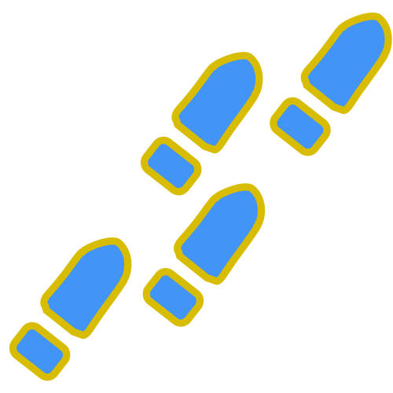
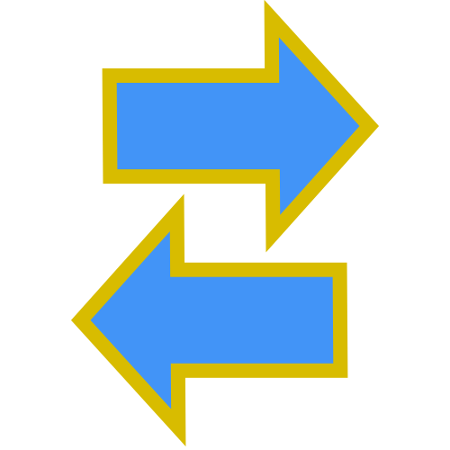
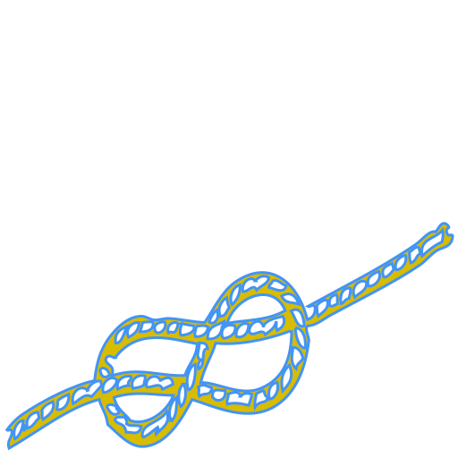

&nbsp;

&nbsp;

####  &nbsp; [2021.07.27 - A super easy way to access bit fields in Java](#bit-diagram)

####  &nbsp; [2021.07.20 - The design of KivaKit validation](#validation)   

####  &nbsp; [2021.07.13 - Broadcasting KivaKit type converters](#converters)  

####  &nbsp; [2021.07.13 - Polymorphic final methods](#polymorphic-final-methods)

####  &nbsp; [2021.07.07 - How *Broadcaster/Listener* improves KivaKit component semantics](#broadcaster)  

####  &nbsp; [2021.07.05 - Mirror methods](#mirror-methods)  

####   &nbsp; [2021.07.04 - A (very) slightly simpler builder pattern](#builder)  

####  &nbsp; [2021.07.03 - Lazy initialization as a Java design pattern](#lazy)  

####  &nbsp; [2021.06.28 - Why project Loom will make Java a better cloud language than Go](#loom)  

####  &nbsp; [2021.06.26 - Constructors are evil (and how we could eliminate them)](#construction)  

####  &nbsp; [2021.06.25 - How KivaKit adds mixins to Java](#mixins) 

####  &nbsp; [2021.06.23 - Why KivaKit provides service locator instead of dependency injection](#service-locator)  

 

 Key KivaKit article

 

 &nbsp;  [Sign up for State(Art) mailing list](http://eepurl.com/hCivUX)

2021.07.27

### A super easy way to access bit fields in Java &nbsp; 

A bit field is a series of bits in a primitive value like an *int* or a *long* that, taken together, can hold a value. For example, display colors are represented with bit fields for red, green, blue and alpha:

    AAAAAAAA RRRRRRRR GGGGGGGG BBBBBBBB

The code required to get and set fields of a primitive involve shifting and masking operations which can be error prone and sometimes hard to follow.

KivaKit provides the *BitDiagram* class to make this task easy. Taking our example of ARGB colors, we can create a *BitDiagram* for colors:

    private static BitDiagram COLOR = new BitDiagram
        ("AAAAAAAA RRRRRRRR GGGGGGGG BBBBBBBB");

In this diagram, the 'A' characters represent *alpha* bits, the 'R' characters represent *red* bits, etc. (spaces in the diagram are ignored). Given the bit diagram COLOR, we can retrieve a *BitField* for each field in the bit diagram by calling *field(char)*:

    private static BitField ALPHA = COLOR.field('A');
    private static BitField RED   = COLOR.field('R');
    private static BitField GREEN = COLOR.field('G');
    private static BitField BLUE  = COLOR.field('B');

These *BitField* objects contain the shift and mask values, determined from the diagram,  needed to retrieve the field value from a primitive. For example, in this code:

    var rgb   = 0xff8040;
    var red   = RED.getInt(rgb);
    var green = GREEN.getInt(rgb);
    var blue  = BLUE.getInt(rgb);

the variable *red* will be 0xff, *green* will be 0x80 and *blue* will be 0x40.

We can use these same *BitField* objects to set values into a primitive value:

    rgb = RED.set(rgb, 0x12);
    rgb = GREEN.set(rgb, 0x34);
    rgb = BLUE.set(rgb, 0x56);

After executing this code, our *rgb* variable will now be 0x123456. The handy *BitDiagram* class is in the *kivakit-kernel* module in [KivaKit](https://www.kivakit.org).

Questions? Comments? Tweet yours to @OpenKivaKit.

2021.07.20
 
### The design of KivaKit validation  &nbsp; 

*KivaKit* objects that implement *Validatable* can participate in *validation*. Validation checks an object for consistency and reports any problems. Note that a single object may have more than one *ValidationType*. For example, validation of user input may be somewhat different from the validation of an object about to be inserted into a database:

    public interface Validatable
    {
        Validator validator(ValidationType type);
    }
 
*ValidationType* is an identifier that has associated sets of classes that should or should not be validated. The *Validator* returned from *Validatable* leverages the *Listener* interface from the KivaKit [*Broadcaster / Listener*](#broadcaster) mini-framework to provide integration with the rest of KivaKit. The *Validator.validate(Listener)* method performs validation, broadcasts any warnings or problems to its *Listener* argument, and returns true if validation discovered no problems.

    public interface Validator
    {
        boolean validate(Listener listener);
    }
 
In the following example, an *Email* object is *Validatable* and its *Validatable.validator()* method returns an anonymous subclass of *BaseValidator*. The *onValidate()* override then provides the actual validation with a series of calls to the *problemIf()* method in *BaseValidator*. For each problem encountered, the validator broadcasts a message. The *BaseValidator* implementation *also* captures these messages, analyzes them and returns true if no problem messages were broadcast by *onValidate()*. This design allows the *Email* class to focus entirely on providing validation logic and not on the plumbing for reporting validation problems.

&nbsp;&nbsp;&nbsp;&nbsp;&nbsp;&nbsp;&nbsp;&nbsp; 

    public class Email implements Validatable
    {
        Set<EmailAddress> to = new HashSet<>();
        EmailAddress from;
        String subject;
        EmailBody body;
        
        @Override
        public Validator validator(ValidationType type)
        {
            return new BaseValidator()
            {
                @Override
                protected void onValidate()
                {
                    problemIf(to == null, "Recipient (to) is missing");
                    problemIf(from == null, "Sender (from) is missing");
                    problemIf(isEmpty(subject), "Subject is missing or empty");
                    problemIf(body == null, "Body is missing");
                }
            };
        }
    }

The actual details of *BaseValidator* are too complex to fully explore here, but the basic execution flow again is:

    validate(Listener)    // Validate, broadcasting problems to Listener
      onValidate()        // Subclass validation implementation
        problemIf()       // If there is a problem,
          addIfNotNull()  // broadcast it and add it to the list of issues
    issues.isValid()      // Return true if there are no important issues
    
&nbsp;&nbsp;&nbsp;&nbsp;&nbsp;&nbsp;&nbsp;&nbsp; 
    
And the implementation of this looks (very roughly) like this:

    public abstract class BaseValidator implements Validator
    {
        // Problems and quibbles captured during validation
        private ValidationIssues issues = new ValidationIssues();
        
        @Override
        public final boolean validate(Listener listener)
        {
            [...]
            
            onValidate();
    
            [...]
            
            return issues.isValid();            
        }

        protected abstract void onValidate();
    
        protected Problem problem(String message, Object... parameters)
        {
            return addIfNotNull(listener.problem(message, parameters));
        }
        
        protected Problem problemIf(boolean invalid, String message, Object... parameters)
        {
            if (invalid)
            {
                return problem(message, parameters);
            }
            return null;
        }

        private <T extends Message> T addIfNotNull(T message)
        {
            issues.add(message);
            return message;
        }
    }

Note that the *validate()* / *onValidate()* methods are an example of the [polymorphic final methods pattern](#polymorphic-final-methods). The validation mini-framework that we've discussed here is available in the kivakit-kernel module in [KivaKit](https://www.kivakit.org).

Questions? Comments? Tweet yours to @OpenKivaKit.

2021.07.13

### Broadcasting KivaKit type converters &nbsp; 

It is common problem to convert one type into another. As with most problems, it is best to begin with the simplest possible design:

    public interface Converter<From, To> extends Repeater
    {
        To convert(From from);
    }

&nbsp;&nbsp;&nbsp;&nbsp;&nbsp;&nbsp;&nbsp; 

In this design, the *convert()* method converts the *From* type into the *To* type. The interface extends *Repeater* so that any warnings or problems that occur during conversion are captured and [broadcast to interested listeners](#broadcaster). 

While this interface perfectly captures a one way conversion, we may want to convert the destination type back to the original type:

    public interface TwoWayConverter<From, To> extends Converter<From, To>
    {
        From unconvert(To to);
    }

Now, a *StringConverter*, as we normally think of it, is just a two-way converter between *String*s and *Value* types:

    public interface StringConverter<Value> extends TwoWayConverter<String, Value>
    {
    }

&nbsp;&nbsp;&nbsp;&nbsp;&nbsp;&nbsp;&nbsp; 

These are fairly elegant interfaces, but what about the implementation?

We would like the base implementation of *Converter* to handle issues that come up that are common to all type converters, namely *null* values and exceptions. We can make use of the [polymorphic final methods pattern](#polymorphic-final-methods) to layer in this functionality for all converters. We will also need to ensure that the converter has at least one listener to hear broadcast problems by making *Listener* a parameter to the constructor.

    public abstract class BaseConverter<From, To> extends BaseRepeater 
        implements Converter<From, To>
    {
        /** True if this converter allows null values */
        private boolean allowNull;
    
        protected BaseConverter(Listener listener)
        {
            listener.listenTo(this);
        }
    
        public BaseConverter<From, To> allowNull(boolean allowNull)
        {
            this.allowNull = allowNull;
            return this;
        }
    
        public boolean allowsNull()
        {
            return allowNull;
        }
    
        /**
         * Converts from the &lt;From&gt; type to the &lt;To&gt; type. 
         * If the from value is null and the converter allows null values, 
         * null will be returned. If the value is null and the converter 
         * does not allow null values a problem will be broadcast. Any 
         * exceptions that occur during conversion are caught and broadcast 
         * as problems.
         */
        @Override
        public To convert(From from)
        {
            // If the value is null,
            if (from == null)
            {
                // and we don't allow conversion of null values,
                if (!allowsNull())
                {
                    // then broadcast a problem
                    problem("${class}: Cannot convert null value", getClass());
                }
                
                // and return null.
                return null;
            }
    
            try
            {
                // Return the converted value.
                return onConvert(from);
            }
            catch (Exception e)
            {
                // If an exception occurs, broadcast a problem
                problem(e, "${class}: Cannot convert ${debug}", getClass(), from);
    
                // and return null.
                return null;
            }
        }
    
        /**
         * The method to override to provide the actual conversion
         */
        protected abstract To onConvert(From value);
    }

In this implementation, any illegal *null* values or exceptions are handled by broadcasting a *Problem* message and returning *null*. This allows converter implementations to focus on the conversion task alone.

Now we can implement our *StringConverter* interface. Besides *null* values and exceptions, *String*s can also be *empty*. To handle this case, we can layer in logic in our base class in a way similar to the way that we dealt with *null* values in *BaseConverter*:

    public abstract class BaseStringConverter<Value> extends BaseConverter<String, Value>
         implements StringConverter<Value>
    {
        /** True if empty strings may be converted */
        private boolean allowEmpty;
    
        protected BaseStringConverter(Listener listener)
        {
            super(listener);
        }
    
        public BaseStringConverter<Value> allowEmpty(boolean allowEmpty)
        {
            this.allowEmpty = allowEmpty;
            return this;
        }
    
        public boolean allowsEmpty()
        {
            return allowEmpty;
        }
    
        @Override
        public final Value onConvert(String string)
        {
            // If we allow null values and our string is null,
            if (allowsNull() && string == null)
            {
                // then return null.
                return null;
            }
    
            // If we allow empty strings and our string is empty,
            if (allowEmpty && Strings.isEmpty(string))
            {
                // then return null.
                return null;
            }
    
            // Return the value of our string converted by the subclass.
            return onToObject(string);
        }
    
        @Override
        public final String unconvert(Value value)
        {
            // If the value is null
            if (value == null)
            {
                // and we allow null values
                if (allowsNull())
                {
                    // return the string representation of null.
                    return nullString();
                }
                else
                {
                    // otherwise, report that we can't convert null values.
                    problem("${class}: Cannot convert null value", getClass());
                    return null;
                }
            }
    
            try
            {
                // Call the subclass to convert the value to a string,
                return onToString(value);
            }
            catch (final Exception e)
            {
                // and broadcast any exception thrown as a problem
                problem(e, "${class}: Cannot unconvert ${debug}", getClass(), value);
                return null;
            }
        }
    
        /**
         * @return The string representation for a null value. 
         * By default this value is null, not "null".
         */
        protected String nullString()
        {
            return null;
        }
    
        /**
         * Implemented by subclass to convert the given string to a value. The 
         * subclass implementation will never be called in cases where 
         * value is null or empty, so it need not check for either case.
         *
         * @param value The (guaranteed non-null, non-empty) value to convert
         * @return The converted value
         */
        protected abstract Value onToValue(String value);
    
        /**
         * Convert the given value to a string
         *
         * @param value The (guaranteed non-null, non-empty) value
         * @return A string which is by default value.toString() if this method is not overridden
         */
        protected String onToString(Value value)
        {
            return value.toString();
        }
    } 

This base class now handles exceptions, *null* values and empty values, only calling *onToString()* with *non-null* values and only calling *onToValue()* with *non-null*, *non-empty* strings. This greatly simplifies the implementation of a converter:

    public class IntegerConverter extends BaseStringConverter<Integer>
    {
        public IntegerConverter(Listener listener)
        {
            super(listener);
        }
    
        protected Integer onToValue(String value)
        {
            return Integer.parseInt(value);
        }
    }

This converter converts from *String* to *Integer* and from *Integer* to *String*. It also handles all boundary conditions: *null* values, *null* strings, empty strings and exceptions, including *NumberFormatException*. All error reporting is via message broadcasting to the listener passed to the constructor. This means that our converter integrates well with the rest of the KivaKit framework. Since *Logger*s are *Listener*s,  we can hook our converter up directly to a logger, and anything that goes wrong will be logged:

    private static Logger LOGGER = LoggerFactory.newLogger();
    
    [...]
    
    var aliens = new IntegerConverter(LOGGER).convert("15");
    if (aliens != null) 
    {
        [...]
    }

We could also capture the errors with *MessageList* and analyze them, or count them with *MutableCount*. Finally, if the class we're working on is a *Repeater*, we can omit the logger declaration and substitute *this*, making our object's error reporting more flexible:

    public MyClass extends BaseRepeater
    {
        [...]
        
        var aliens = new IntegerConverter(this).convert("15");
        if (aliens != null) 
        {
            [...]
        }
        
        [...]
    }

In another article, we can take a look at how converters are used to implement other features in KivaKit. In the meantime, the simplified conversion code we've explored above is available for use in kivakit-kernel in the [KivaKit](https://www.kivakit.org) project.

Questions? Comments? Tweet yours to @OpenKivaKit.

2021.07.13

### Polymorphic final methods &nbsp; 

A *polymorphic* class literally has "many shapes". Subclasses can add functionality and specialize methods of the parent class by *overriding* them:

    public abstract class FlyingObject
    {
        public abstract void launch();
    }
    
    public class Spaceship extends FlyingObject
    {
        @Override
        public void launch()
        {
            countdown();
            blastOff();
        }
    
        [...]
    }
    
    public class JetFighter extends FlyingObject
    {
        @Override
        public void launch()
        {
            taxi();
            waitForTower();
            takeOff();
        }
    
        [...]
    }

In this case, *Spaceship* and *JetFighter* are both *FlyingObject*s, and both implement the *launch()* method in different ways. The *Spaceship* undergoes a countdown and then blasts off. The *JetFighter* taxis to the end of the runway, waits for clearance from the tower and then takes off. 

But all launches require a systems check and a flight status report. How can we provide *all* launches with some common functionality? A simple variation on the [*template method design pattern*](https://en.wikipedia.org/wiki/Template_method_pattern) will do the trick. In this pattern, a method in the base class provides centralized logic which cannot be overridden. This logic calls a method of the same name, but with "on" as a prefix. 

For example, the *launch()* method below is *final*, and it calls *onLaunch()* in the middle of its logic. The *onLaunch()* method is a *protected abstract* method that *can* be overridden, allowing subclasses to indirectly specialize the behavior of the method *launch()* even though it is *final* and cannot be overridden. We can call the *launch()* method below a *polymorphic final method*:

    public abstract class FlyingObject extends BaseRepeater
    {
        public final void launch()
        {
            systemsCheck();
            onLaunch();
            reportFlightStatus();
        }
        
        [...]
        
        protected abstract void onLaunch();
    }
    
    public class Spaceship extends FlyingObject
    {
        @Override
        protected void onLaunch()
        {
            countdown();
            blastOff();
        }
    
        [...]
    }
    
    public class JetFighter extends FlyingObject
    {
        @Override
        protected void onLaunch()
        {
            taxi();
            waitForTower();
            takeOff();
        }
    
        [...]
    }

By providing the ability to "wrap" the *onLaunch()* polymorphic method in logic, we achieve a special kind of leverage. We can affect all implementations of *onLaunch()* by altering the logic in *launch()*. For example, above we do a *systemsCheck()* that is common to all *FlyingObjects* before calling *onLaunch()*, and we *reportFlightStatus()* after the launch completes. If we discover that we want to know how long *any* launch takes we can simply add this logic to the launch method:

    public final void launch()
    {
        systemsCheck();
        var start = Time.now();
        onLaunch();
        information("Launch procedure took $", start.elapsedSince());
        reportFlightStatus();
    }

The *polymorphic final method* pattern is used throughout [KivaKit](https://www.kivakit.org).

Questions? Comments? Tweet yours to @OpenKivaKit.

2021.07.07

### How *Broadcaster/Listener* improves KivaKit component semantics &nbsp; 

Dr. Alan Kay's conception of object-oriented programming in the late 1960's came about, in part, as a result of his undergraduate work in molecular biology. A cell is a pretty good analogy for an object and DNA is a sort of template or class from which cells are created. But to Kay, what would have been most interesting were cell surface receptors, and the way that cells pass various kinds of messages to each other (and themselves) by secreting compounds that bind to these receptors. He posted this revealing email in 1998:

> [...] Smalltalk is not only NOT its syntax or the class library, it is not even about classes. I'm sorry that I long ago coined the term "objects" for this topic because it gets many people to focus on the lesser idea. The big idea is "messaging" [...] 

Which brings us to the *Broadcaster/Listener* design pattern. A language like Java, with statically bound, synchronously invoked methods, is not at all what Dr. Kay means when he talks about messaging. But even if Java isn't a dynamic, late-bound, messaging-oriented language, we can still do some interesting messaging in Java. The *Broadcaster/Listener* design pattern is one way to do it, and it turns out to be very useful and powerful.

A *Broadcaster* is a *Transmitter* that transmits *Messages* to an audience of one or more *Listeners*:

&nbsp;&nbsp;&nbsp;&nbsp;&nbsp;&nbsp;&nbsp;&nbsp; 

A *Broadcaster* keeps a list of *Listener*s (the audience) to which it will transmit messages. Listeners can be added and removed from the list. When the *transmit(Transmittable)* method is called with a message, that message is given to each member of the audience:

    public interface Transmitter<T extends Transmittable>
    {
        void transmit(T value);
    }
    
    public interface Broadcaster extends Transmitter<Transmittable>
    {
        void addListener(Listener listener);
        void removeListener(Listener listener);
    }

A *Listener* receives messages sent to it with its *receive(Transmittable)* method. Different implementations of this interface may do different things with the message:

    public interface Listener<Transmittable>
    {
        default <T extends Broadcaster> T listenTo(T broadcaster)
        {
            broadcaster.addListener(this);
            return broadcaster;
        }
       
        void receive(Transmittable message);
    }

Here are a few examples of the many *Listener*s in KivaKit, just to give an idea of the range of tasks that listeners can perform:

| Listener | Purpose |
|---------|--------|
| Logger | Write the message to a Log |
| MutableCount | Counts the number of messages it receives |
| MessageList | Keeps a list of the messages it receives |
| ThrowingListener | Throws an exception containing the message |
| ConsoleWriter | Formats and writes the message to the console |
| StatusPanel | A Swing panel that displays messages it receives |
| NullListener | A listener that discards the messages it receives |
| ValidationReporter | Reports validation problems it receives |

A *Repeater* is both a *Listener* and a *Broadcaster*. When a repeater hears a message via *receive()*, it re-broadcasts it with *transmit()*:

    public interface Repeater extends Listener, Broadcaster
    {
        @Override
        default void receive(Transmittable message)
        {
            transmit(message);
        }
    }

This process of listening and re-broadcasting forms a *listener chain*:

    broadcaster -> repeater -> listener

A repeater can, of course, listen to other repeaters, forming longer listener chains:

    broadcaster -> repeater -> repeater -> repeater -> listener

For example:

    class EmployeeLoader extends BaseRepeater
    {
        [...]
         
        problem("Unable to load $", employee);
    
        [...]
    }
    
    class PayrollProcessor extends BaseRepeater
    {
         [...]
    
         var loader = listenTo(new EmployeeLoader());
         
         [...]
    }
    
    var processor = LOGGER.listenTo(new PayrollProcessor());

Here, if the *EmployeeLoader* class can't load employees, it reports a problem via the *problem()* method. The *problem()* method in *BaseRepeater* broadcasts a *Problem* message to all listeners of *EmployeeLoader*. The *PayrollProcessor* class creates and listens to an instance of *EmployeeLoader*. Since *PayrollProcessor* is itself a repeater, any messages that the *EmployeeLoader* broadcasts to *PayrollProcessor* will be re-broadcast by *PayrollProcessor* to each of its listeners. 

The final line of code listens to messages from *PayrollProcessor* with a *Logger*. So if something goes wrong loading employees, the problem message goes from *EmployeeLoader* through *PayrollProcessor* to *Logger*, where it gets logged:

    EmployeeLoader -> PayrollProcessor -> Logger

This design yields a lots of flexibility as well as clean, simple error handling with very little code.

A class can implement the *Repeater* interface in two ways. It can extend *BaseRepeater* (as above) or it can implement *RepeaterMixin* if it already has a base class. For more details on how mixins work in KivaKit, see [How KivaKit adds mixins to Java.](#mixins)

The ability to arbitrarily chain messages, particularly messages that represent some kind of warning or problem, greatly increases component flexibility:

- A class that is a *Broadcaster* or *Repeater* can broadcast problem messages when things go wrong. Rather than throwing an exception to signal a problem, the class can let the caller decide that it wants those semantics by installing a *ThrowingListener*. Rather than returning an error code or an object with error information, the class can let the caller choose to listen for messages with a *MessageList*, allowing it to decide what to do with the messages it captures. The caller might decide that certain problem messages should be logged with a *Logger*, or it might just want to repeat messages to its own listeners. There's really no limit to the error handling semantics that can be plugged into a component that broadcasts its status with messages. **By reporting all problems in a unified way as *messages*, our class is simplified and abstracted away from the error handling requirements of the caller**.

- **Objects that broadcast problem messages don't need to use method return values to provide error information. This allows methods to make full use of their return values.** An object that broadcasts problem messages doesn't need to do anything further in terms of providing error information (it can even create new messages that include additional information). It might return a *boolean* or a value that can be *null* if the method failed, but the description of what went wrong (or where or when) is never a concern.

- It is very typical for long listener chains to simply terminate with a *Logger*. But that doesn't have to be the case. Messages might be directed, for example, to a statistics class that gathers information about how many messages of different types reach the end of the chain. Messages might even be directed to more than one terminal listener. **The ability to redirect whole chains of listeners to an arbitrary set of destination(s) is a powerful design**.

KivaKit has hundreds of classes that are *Repeaters*. This allows most non-trivial components to be chained together with ease. A short, randomly selected list of classes in KivaKit that are repeaters:

| Repeater | Purpose |
|---------|---------|
| Converter | Convert one type to another |
| Resource | Provides access to streamed resources |
| EmailSender | Sends emails |
| Application | Base application class that logs messages by default |
| ConnectionListener | Listens for server connections |
| JarLauncher | Downloads and launches a JAR file |

Each of these classes listens to errors from components it uses and broadcasts problems to its own listeners.

The simplified *Broadcaster/Listener* design pattern discussed above is available in its entirety in *kivakit-kernel* and is used throughout [KivaKit](https://www.kivakit.org) for messaging between components.

Questions? Comments? Tweet yours to @OpenKivaKit.

2021.07.05

### Mirror methods &nbsp; 

This article describes a simple syntactic idea that could make object-oriented programming a little nicer. One legitimate criticism of object-oriented programming is that it is sometimes pretty arbitrary which object should have a method. 

For example, since aliens are able to convert themselves to and from pure energy, we might write:

    public class Alien
    {
        public PureEnergy toPureEnergy()
        {
            [...]
        }
    }
    
    public class PureEnergy
    {
        public Alien toAlien()
        {
            [...]
        }
    }

&nbsp;&nbsp;&nbsp;&nbsp;&nbsp;&nbsp;&nbsp;&nbsp;  

But we could just as easily write:

    public class Alien
    {
        public static Alien fromPureEnergy(PureEnergy energy)
        {
            [...]
        }
    }
    
    public class PureEnergy
    {
        public static PureEnergy fromAlien(Alien alien)
        {
            [...]
        }
    }

The code in the first example seems preferable since it doesn't use static methods, but  our code is split between two classes. What if the conversion between aliens and pure energy involves common code that we might like to keep private to a single class?

One way to get around this might be to create a converter interface like:

    public class AlienTransmogrifier
    {
        Alien fromPureEnergy(PureEnergy energy);
        PureEnergy toPureEnergy(Alien alien);
    }

The logic is separate now and more flexible, but we have a whole extra class that is going to have to access properties of *both* classes to perform calculations (possibly breaking encapsulation). And in some cases, maybe we *don't* want this flexibility, so the class is just a waste.

This is where mirror methods come in. What if we could define all of our energy conversion logic (it turns out to be quite easy) in one class, say *Alien*, but make it accessible in *PureEnergy*, without writing any additional code?  

First, lets put all of our extraterrestrial physics logic in one place, in *Alien*:

    public class Alien
    {
        public PureEnergy toPureEnergy()
        {
            [...]
        }
        
        public static Alien fromPureEnergy(PureEnergy energy)
        {
            [...]
        }
    }

This is great for encapsulating our conversion logic. But now if we have a *PureEnergy* object we can't just say *energy.toAlien()*. We won't even know that this conversion is possible unless we happen to look at *Alien*. That's not good for API ease-of-use.

Now, the idea. What if we could solve this whole problem by just adding an annotation? With plenty of [handwaving](https://en.wikipedia.org/wiki/Hand-waving) concerning compilers and language specs, we have:
 
    public class Alien
    {
        @MirrorMethod("toAlien")
        public static Alien fromPureEnergy(PureEnergy energy)
        {
            return [...]
        }
    }

The *@MirrorMethod* annotation here specifies that the *PureEnergy* class should automatically (without writing any code) have the mirror method *PureEnergy.toAlien()*:

    public class PureEnergy
    {
        public Alien toAlien()
        {
            return Alien.fromPureEnergy(this);
        }
    }

The same goes for the other mirrored method. The *toPureEnergy()* method:

    public class Alien
    {
        @MirrorMethod("fromAlien")
        public PureEnergy toPureEnergy()
        {
            return [...]
        }
    }

would automatically imply the existence of this mirror method:

    public class PureEnergy
    {
        public static PureEnergy fromAlien(Alien alien)
        {
            return alien.toPureEnergy();
        }
    }

Now, we have centralized, encapsulated logic in the *Alien* class that supports all four of our conversion use cases and is easily discovered with IDE autocompletion: 

    alien.toPureEnergy()
    alien.fromPureEnergy(PureEnergy)
    energy.toAlien()
    PureEnergy.fromAlien(Alien)

*But how does the mirror method feature figure out how and where to implement these methods?*. 

All mirror methods follow these rules:

1. The mirror method has to have the same return value
2. The implementation of a mirror method has to call the method being mirrored
3. If the mirrored method is static with no parameters, it cannot be mirrored
4. If the mirrored method is static with one or more parameters, the mirror method will be an instance method in the class of the mirrored method's first parameter. It will pass *this* as the first parameter when calling the mirrored method.
5. If the mirrored method is an instance method with no parameters, the mirror method will be a static method in the class of the return value. It will take the enclosing class of the mirrored method as the class of its first parameter and will use that reference to call the mirrored method.
6. If the mirrored method is an instance method with one or more parameters, the mirror method will be placed in the class of the first parameter. It will take the enclosing class of the mirrored method as the class of its first parameter, and it will pass *this* as the first parameter when calling the mirrored method.
7. Any parameters beyond the first parameter will be parameters to the mirror method and will be passed through when calling the mirrored method.

So, the mirror method of this (repeated from above):

    public class Alien
    {
        @MirrorMethod("toAlien")
        public static Alien fromPureEnergy(PureEnergy energy)
        {
            return [...]
        }
    }
        
has to look like this (by rules 1, 2 and 4):

> (4) If the mirrored method is static with one or more parameters, the mirror method will be an instance method in the class of the first parameter. It will pass *this* as the first parameter when calling the mirrored method.

    public class PureEnergy
    {
        public Alien toAlien()
        {
            return Alien.fromPureEnergy(this);
        }
    }

In the case of the other mirror method above, the mirror method of this:

    public class Alien
    {
        @MirrorMethod("fromAlien")
        public PureEnergy toPureEnergy()
        {
            return [...]
        }
    }
    
will be this (by rules 1, 2 and 5):

> (5) If the mirrored method is an instance method with no parameters, the mirror method will be a static method in the class of the return value. It will take the enclosing class of the mirrored method as the class of its first parameter and will use that reference to call the mirrored method.

    public class PureEnergy
    {
        public static PureEnergy fromAlien(Alien alien)
        {
            return alien.toPureEnergy();
        }
    }

Let's take a look at another example using the same process:

This mirror method here:

    public class Distance
    {
        @MirrorMethod("speedToGo")
        public Speed per(Duration duration)
        {
            return [...]
        }
    }    

infers the existence of this method (by rules 1, 2 and 6):

> (6) If the mirrored method is an instance method with one or more parameters, the mirror method will be placed in the class of the first parameter. It will take the enclosing class of the mirrored method as the class of its first parameter, and it will pass *this* as the first parameter when calling the mirrored method.

    public class Duration
    {
        public Speed speedToGo(Distance distance)
        {
            return distance.per(this);
        }
    }
    
Now we can say either of these two things:

    var speed = Distance.miles(1).per(Duration.minutes(4));
    var speed = Duration.minutes(4).speedToGo(Distance.miles(1));

and both resolve to the same code.

Questions? Comments? Tweet yours to @OpenKivaKit.

2021.07.04

### A (very) slightly simpler builder pattern &nbsp; 

[Frank Kiwy](https://blogs.oracle.com/author/frank-kiwy) recently published, in Java Magazine, the article [*Exploring Joshua Bloch’s Builder design pattern in Java: Bloch’s Builder pattern can be thought of as a workaround for a missing language feature*](https://blogs.oracle.com/javamagazine/java-builder-pattern-bloch). I have a fine point to make about the code example in this article. There is a way to eliminate a bit of repetition (mentioned in the article as a point of criticism of the pattern), making the code just a little easier to read and more succinct. The example looks something like this (I've reduced the number of fields and changed the formatting, because I'm just like that):

    public class Book 
    {
        private final String isbn;
        private final String title;
        private final String author;
        
        private Book(Builder builder) 
        {
            this.isbn = builder.isbn;
            this.title = builder.title;
            this.author = builder.author;
        }
    
        public String getIsbn() 
        {
            return isbn;
        }
    
        public String getTitle() 
        {
            return title;
        }
    
        public String getAuthor() 
        {
            return author;
        }
        
        public static class Builder 
        {
            private final String isbn;
            private final String title;
            private String author;
    
            public Builder(String isbn, String title) 
            {
                this.isbn = isbn;
                this.title = title;
            }
    
            public Builder author(String author) 
            {
                this.author = author;
                return this;
            }
    
            public Book build() 
            {
                return new Book(this);
            }
        }
    }

My quibble is that we can get rid of the duplicate fields in the *Builder* class in the code above by instead using an instance of *Book*. My version is a little bit simpler and clearer, doesn't repeat assignments, and the line count drops from 52 lines in "Josh's builder pattern" to 49 in mine (and with more fields there will be more difference). It *is* true that in my version, the fields in *Book* are no longer explicitly declared as *final*. However, this makes no practical difference because the fields can't be mutated except by *Builder*.

    public class Book 
    {
        private String isbn;
        private String title;
        private String author;
        
        private Book() 
        {
        }
    
        public String getIsbn() 
        {
            return isbn;
        }
    
        public String getTitle() 
        {
            return title;
        }
    
        public String getAuthor() 
        {
            return author;
        }
        
        public static class Builder 
        {
            private Book book = new Book();
    
            public Builder(String isbn, String title) 
            {
                book.isbn = isbn;
                book.title = title;
            }
    
            public Builder author(String author) 
            {
                book.author = author;
                return this;
            }
    
            public Book build() 
            {
                var built = book;
                book = new Book();
                return built;
            }
        }
    }
     
Questions? Comments? Tweet yours to @OpenKivaKit.

2021.07.03

### Lazy initialization as a Java design pattern &nbsp; 

It would be interesting for Java to have a *lazy* keyword. This imaginary keyword would only evaluate the expression to the right of the equals sign when the reference on the left side is accessed. Code using this keyword might look like this:

    private lazy Map<Key, Value> lazyMap = createMap();
    
    [...]
    
    lazyMap.put(key, value);

Here, just before *lazyMap.put()* is executed, the *createMap()* method would be called and its value assigned to *lazyMap*.

Instead, a common and less succinct idiom in Java is something like this:

    private Map<Key, Value> lazyMap;
    
    [...]
    
    if (lazyMap == null)
    {
        lazyMap = createMap():
    }
    
    lazyMap.put(key, value);

We can't (easily) introduce the *lazy* keyword that we'd like into Java, but we can create a class with similar functionality:

    public class Lazy<Value>
    {
        /**
         * Factory method to create a Lazy object with the given value factory
         */
        public static <V> Lazy<V> of(Factory<V> factory)
        {
            return new Lazy<>(factory);
        }
    
        private Value value;
    
        private Factory<Value> factory;
    
        protected Lazy(final Factory<Value> factory)
        {
            this.factory = factory;
        }
        
        public synchronized Value get()
        {
            if (value == null)
            {
                value = factory.newInstance();
            }
            return value;
        }
    }

*Lazy* can reduce the four lines of if-*null* check boilerplate above to these two lines:

    private Lazy<Map<Key, Value>> lazyMap = Lazy.of(this::createMap);
    
    [...]
    
    lazyMap.get().put(key, value);

True, it's not quite as nice as having a *lazy* keyword, but it improves readability by making the flow of code easier to follow. The *Lazy* class is available in kivakit-kernel in the [KivaKit](https://www.kivakit.org) project.

Questions? Comments? Tweet yours to @OpenKivaKit.

2021.06.28

### Why project Loom will make Java a better cloud language than Go  &nbsp; 

At first glance, the *Go* programming language in 2021 looks and feels to me a bit like garbage collected C. It *isn't* for a number of reasons, but it is certainly more of a systems programming language than a pure applications programming language like Java. Putting aside lots of small features and improvements, we've seen most of what Go has to offer before. So *why are so many people using Go to write cloud applications*? The main reason is that the cloud is highly concurrent and Go has a killer feature for concurrency: *go routines*.

By simply putting the word *go* in front of any statement in Go, you can execute that code concurrently. This is a neat feature itself, but the big deal here is that this concurrent execution occurs on a *lightweight thread* that is scheduled by the Go runtime rather than by the kernel. When a go routine reaches certain points in the code, such as entering a function or blocking on I/O, the Go runtime can cause the go routine to yield execution to another go routine that is associated with the same underlying kernel thread. To do this, Go saves the stack of the go routine that is yielding in a *continuation* data structure and restores the stack of whatever go routine is being scheduled to execute next.

Why is this so important? Because kernel threads are an expensive and limited resource. They have relatively large stacks and context switching between them is expensive (particularly between threads running in different processes). By comparison, Go's lightweight user-mode threads are very cheap. They have low memory overhead and context switching between them is very fast when compared with kernel mode time-slicing. This allows the creation of *millions* of lightweight threads with little performance degradation. By comparison, only a few thousand kernel threads will cause your OS to grid to a halt.

In the world of the cloud, where huge numbers of requests are typically blocked on I/O talking to users or other cloud resources at any given time, being able to schedule all those concurrent requests efficiently is crucial. This is only possible at the present time in Java by using limited thread pools that schedule and perform asynchronous operations for client threads. This asynchronous style of coding is complex, ugly, error-prone and very difficult to debug, so being able to do this with the *go* keyword is a huge advantage today.

Enter project Loom.

[Project Loom](https://blogs.oracle.com/javamagazine/going-inside-javas-project-loom-and-virtual-threads) is Java's answer to lightweight user-mode threads, and it will likely make Java very competitive with Go as a cloud language. Loom's lightweight threading model is designed to be fully compatible with Java's existing threading model, so you won't have to learn anything to use it. This feat has been accomplished by integrating Loom's *virtual threads* with *java.lang.Thread* and *java.util.concurrent.Executor*. The only different between kernel threads and Loom's virtual threads are how threads are initially created.

A thread builder in the *Thread* class will allow threads to be created as virtual. With this functionality, Java can easily mimic the functionality provided by the *go* statement in Go:

    public static Thread go(Runnable code) 
    {
        return Thread.builder()
                     .virtual()
                     .task(code)
                     .build()
                     .start();
    }

Usage of this utility method then looks like this:

    go(() -> launchSpaceShip(cargo));

In addition, Java will add seamless support for *structured concurrency*, where sub-tasks can be executed with the parent thread waiting for them to complete, all in one nice try-with-resources statement:

    try (var executor = Executors.newVirtualThreadExecutor()) 
    {
        executor.submit(this::warmUpEngines);
        executor.submit(this::stabilizeCoolBlinkingLights);
    }
    
    launchSpaceShip();
    
Here, the two submitted tasks will execute on virtual threads, and when both have completed, the *AutoCloseable.close()* method invoked by the try block will return and the spaceship will be launched. We could even make a utility method to reduce this code to the minimum:

    public static void run(Runnable... runnables)
    {
        try (var executor = Executors.newVirtualThreadExecutor()) 
        {
            for (var code : runnables)
            {
                executor.submit(code);
            }
        }
    }
    
This method allows our code is reduced to just this:
    
    run(this::warmUpEngine, this::stabilizeCoolBlinkingLights);
    launchSpaceShip();

Right now, Go is a reasonable choice for cloud development, but when Project Loom does arrive (when will this be?), Java will have Go's killer cloud feature. It will also have a much bigger ecosystem, excellent tooling and, in my opinion, better readability. Many people will stick with Go when this happens, but there will be no good reason at that point not to prefer Java for new projects.

Questions? Comments? Tweet yours to @OpenKivaKit.

2021.06.26

### Constructors are evil (and how we could eliminate them) &nbsp; 

Methods for creating and initializing objects vary some from language to language, but most object-oriented languages allocate an object, often with a keyword such as *new*, and then perform object initialization using specialized methods called [constructors](https://tinyurl.com/5686t2km). One of the problems with constructors is that an object is not fully initialized until the constructor returns, which means that *during construction* the object is in a semi-initialized and possibly inconsistent state. This problem can be partly addressed with special compile-time checking, but even with this in place, constructors can still cause surprising and hard-to-diagnose problems:

1. Invoking overridable methods during construction can result in the use of data by subclasses that are not yet properly initialized.
2. Constructors can allow the object's *this* reference to "escape" by being assigned to some field that is accessible by another thread. This other thread can then potentially use that field to access the object before its initialization has completed.
3. [Class initialization in Java can cause deadlocks](https://www.farside.org.uk/201510/deadlocks_in_java_class_initialisation)
4. Access to the static field(s) of a base class in Java does not cause the initialization of any subclasses, even though those subclasses might initialize these field(s). This can result in [counterintuitive behavior](https://stackoverflow.com/questions/10698516/behavior-of-static-blocks-with-inheritance).

In addition, fields are implicitly initialized during construction and the order of initialization is lexical. This can result in code that doesn't compile because the value of one field depends on another field that isn't yet initialized.

How can we solve some of the problems that constructors create?

Let's begin by thinking about how objects are initialized using a simple state diagram, where constructor invocation is represented by the state *initializing*:

    allocated -> initializing -> ready

In order to get rid of the problems with partially initialized objects, we need to get rid of the *initializing* state and transition directly from the allocated state to the ready state:

    allocated -> ready

Further, this transition must be *atomic*. An object should either be *allocated* or *ready*, but not in any state in between. But we still need to initialize the object's internal state at some point. How can we do this without including an *initializing* state?

Let's try a thought-experiment where we associate an actual state machine with each object. Initially this state machine will be in the *allocated* state. When the object has been fully initialized (by calling methods on the object), it will transition to *ready*. 

&nbsp;&nbsp;&nbsp;&nbsp;&nbsp;&nbsp;&nbsp;&nbsp;  

We can specify this transition by adding two new keywords to our language: *is* and *when*:

    public class Alien
    {
        is ready when brain != null && spaceship != null;
        
        private Brain brain;
        private Spaceship spaceship;
        
        [..]
    }

The *is-when* statement here specifies that when our *allocated* *Alien* has both a *brain* and a *spaceship* (aliens have plug-and-play brains), it will transition to the state *ready*. 

&nbsp;&nbsp;&nbsp;&nbsp;&nbsp;&nbsp;&nbsp;&nbsp; 

Now we can simply allow methods to mutate the *brain* and *ship* fields to trigger this transition. But some methods cannot function in the *allocated* state. These methods need to be *gated* until our *Alien* reaches the *ready* state. We can do this by adding the keyword *can*:

    public class Alien
    {
        is ready when brain != null && ship != null;
        can attack() when ready;
    
        private Brain brain;
        private Spaceship ship;
        
        public void brain(Brain brain) { this.brain = brain; }
        public void spaceship(Spaceship spaceship) { this.spaceship = spaceship; }
    
        public void attack()
        {
            if (brain.readyToAttack() && spaceship.readyToLiftOff())
            {
                // TODO
            }
        }
    }

The method *attack()* can only be called now when the *Alien* is in state *ready*. And the *Alien* is only *ready* if it has a *brain* and a *spaceship*, which implies that both the *brain()* and *spaceship()* methods have been called with non-null values.

One nice thing about this design is that eliminating constructors in favor of a state machine not only fixes our issue with partial initialization, but it also eliminates the clutter of constructor overloads and the confusion of constructors with too many parameters. Instead, initialization is both safe and clear:
    
    var alien = new Alien();
    alien.brain(quantumComputer);
    alien.spaceship(spaceshipZim);
    alien.attack();

With our *is-when* statement, if we forget to add a *Brain* to the *Alien* the compiler can give us an error reminding us that we can't call the *attack()* method until the *Alien* has both a *brain* and a *spaceship*:

    var alien = new Alien();
    alien.spaceship(spaceshipZim);
    alien.attack();
    
    [...]
    
    Compile error: method attack() requires Alien to be 'ready'

The *is-when* declaration makes our *Alien* more robust and also serves as a form of documentation, making it clear what has to be done to reach a given state and which methods can be invoked in each state.

So, perhaps we have moved closer to a solution for the object construction problem, but maybe we could use this state machine idea to solve other domain-specific problems. What if users could declare their own states?

Suppose we have a *SubspaceRadio* object that can be connected to a *SubspaceNetwork*. It might have additional states:

    public class SubspaceRadio
    {
        is ready when network != null;
        can connect when ready;
        can transmit when connected;
        can receive when connected;
        can disconnect when connected;
 
        private SubspaceNetwork network;

        public void network(SubspaceNetwork network) { this.network = network; }
        
        public void connect() 
        {
            if (network.connect(this))
            {
                is connected; 
            }
        }
        
        public void disconnect()
        {
            if (network.disconnect(this))
            {
                is ready;
            }
        }
        
        public void transmit()
        {
            [...]
        }
        
        public void receive()
        {
            [...]
        }
    }
    
In this example, our radio object is *ready* as soon as it has a *network*. It can then transition to the *connected* state via a call to *connect()*, at which point it can *transmit()* and *receive()*. If *disconnect()* is called, the radio transitions back to *ready*, at which point it would have to reconnect with *connect()* before it can *transmit()* or *receive()* again.

Because the transition to *connected* is dynamic and conditional on whether the *network.connect()* method can establish a connection, this state machine transition cannot be determined at compile time. Instead, the compiler has to associate some of parts of the state machine with the object at runtime.

Note also that we might want to deny access to methods in a given state, such as if the radio is shut down. We can add another keyword and a wildcard pattern to permit this:

    cannot * when shutdown;
    
    public void shutdown() 
    {
        [...]
        
        is shutdown;
    }

The object can no longer be used once it is *shutdown*.

Questions? Comments? Tweet yours to @OpenKivaKit.

2021.06.25

### How KivaKit adds mixins to Java  &nbsp; 

[Traits](https://tinyurl.com/2n6bbnv3) are a language feature in Scala, Groovy, Kotlin and other languages which allow groups of methods to be added to objects in arbitrary combinations. Unlike interfaces, however, traits can contain method bodies, which allows traits to provide objects with new behaviors. With the addition of [default methods](https://docs.oracle.com/javase/tutorial/java/IandI/defaultmethods.html), Java now provides some of the features of traits, as described by Emil Forslund in [Traits in Java 8: Semantic, DRY-compliant, Interface-first Code](https://dzone.com/articles/definition-of-the-trait-pattern-in-java).

When traits include state, they are referred to as *stateful traits* or *mixins*. It is also possible to implement mixins in Java:

    public interface Mixin
    {
        /**
         * Retrieves state associated with the given Mixin sub-interface. 
         * This is done in MixinState using a composite key formed
         * from this object's *this* reference and the type of the Mixin 
         * sub-interface.
         *
         * @param type The sub-interface's type (like AttributedMixin.class)
         * @param factory A factory that creates the initial state to
         * associate with this mixin
         * @return The state for this mixin
         */
        default <T> T state(Class<? extends Mixin> type, Factory<T> factory)
        {
            // Retrieve the state for this mixin that is attached to this object
            return MixinState.get(this, type, factory);
        }
    }

Here, the *state()* method allows any interface extending *Mixin* to retrieve associated state for itself. If the state is not yet attached to the mixin, it is created with the given *Factory*. The *MixinState* class that is used in the body of the *state()* method stores and retrieves state using a key that combines the object's *this* reference and the *Class* of the mixin sub-interface:

    class MixinState
    {
        private static final Map<MixinKey, Object> values = new ConcurrentHashMap<>();
    
        /**
         * @return Gets a value for the given mixin of the given object, 
         * creating a new value with the given factory if it doesn't 
         * already exist.
         */
        @SuppressWarnings("unchecked")
        public static synchronized <T> T get(final Object object,
                                             final Class<? extends Mixin> mixinType,
                                             final Factory<T> factory)
        {
            // Create a composite key (to allow multiple traits on an object),
            final var key = new MixinKey(object, mixinType);
    
            // get any current value for the mixin,
            var value = (T) values.get(key);
    
            // and if none exists,
            if (value == null)
            {
                // create a new value,
                value = factory.newInstance();
    
                // and store that.
                values.put(key, value);
            }
    
            return value;
        }

This allows each object to have state for many mixins associated with it. Note that an object using mixin(s) does not need to implement the *hashCode()* / *equals()* contract. Also note that mixin state is stored by the package private class *MixinState* using a *ConcurrentHashMap* to avoid concurrency problems. Access to this map may become contentious if there are a large number of objects accessing mixin state at the same time.

To define a new *Mixin*, we can now simply extend the *Mixin* interface and use the *state()* method in our interface's default methods to access our state, as needed:

    public interface AttributedMixin<Key, Value> extends Mixin
    {
        default Value attribute(Key key)
        {
            return map().get(key);
        }
    
        default Value attribute(Key key, Value value)
        {
            return map().put(key, value);
        }
    
        private HashMap<Key, Value> map()
        {
            return state(AttributedMixin.class, () -> new HashMap<>());
        }
    }

Our *AttributedMixin* can now be added to any object, and it will provide a keyed attribute attached to that object. For example, it can be used like this to add a name to any arbitrary class:

    public class AttributedMixinTest
    {
        static class A implements AttributedMixin<String, String> { }
    
        static class B implements AttributedMixin<String, String> { }
    
        @Test
        public void test()
        {
            final var a = new A();
            final var b = new B();
    
            a.attribute("name", "This is object A");
            b.attribute("name", "This is object B");
    
            ensureEqual("This is object A", a.attribute("name"));
            ensureEqual("This is object B", b.attribute("name"));
        }
    }

This is a unit test for *AttributedMixin* from *kivakit-kernel* which is a module in [KivaKit](https://www.kivakit.org). 

Questions? Comments? Tweet yours to @OpenKivaKit.

2021.06.23

### Why KivaKit provides service locator instead of dependency injection &nbsp; 

Martin Fowler does a nice job of describing the *service locator* (SL) design pattern and *dependency injection* (DI) in his article [Inversion of Control Containers and the Dependency Injection pattern](https://martinfowler.com/articles/injection.html#ServiceLocatorVsDependencyInjection). The basic distinction between these two patterns is that in DI, a container pushes interfaces into an object based on its configuration while in SL, the object reaches out to the container to ask for the interface. While I agree overall with what this article has to say (and I think we *all* agree on the principle of decoupling), I have a couple of fine points to add to the discussion.

DI is not *fully* equivalent to SL. Both can be used effectively to decouple dependencies, and both get the job done. However, DI violates a core tenet of object-oriented programming: *encapsulation*. Whether you are doing constructor injection, setter injection or field injection, you are ultimately *pushing* an *implementation detail* into an object, which is the very definition of breaking encapsulation (for a detailed discussion on this subject, see Alan Holub's excellent and provocative article [Why getter and setter methods are evil](https://www.infoworld.com/article/2073723/why-getter-and-setter-methods-are-evil.html)).

Consider the case of an *Alien* that requires a *QuantumDatabase* implementation to find out what planet to attack next. If we ignore all the arcane details of any particular DI framework, the dependency injection code for our alien might look like this:

    interface QuantumDatabase 
    {
        Planet queryPlanetToAttack(Alien alien);
    }
	
    class Alien
    {
        @Inject
	    private QuantumDatabase database;
	    
	    public void attackPlanet()
	    {
        	    var planet = database.queryPlanetToAttack(this);
        	    
        	    // TODO
	    }
    }
	
The DI framework here knows how to inject a *QuantumDatabase* implementation into our *Alien* object by looking at the type (and potentially the name) of the private *database* field. This is simple enough, and although it does break encapsulation, it accomplishes the loose coupling we require.

Now, let's look at how SL might solve the same problem:

    class Alien
    {
        public void attackPlanet()
        {
	        var planet = Registry.of(this)
	            .lookup(QuantumDatabase.class)
	            .queryPlanetToAttack(this);
	            
	        // TODO
        }
    }
    
The statement *Registry.of(this)* finds the right *Registry* object to use to find our *Alien* object (this is normally a global registry, but it could vary in some circumstances). Then the *lookup()* method yields an implementation of the *QuantumDatabase* interface for the *Alien* to use.

These two approaches seem identical at first glance, but there *is* one subtle difference. When the *attackPlanet()* method returns in the DI example, the *database* field still holds a reference to the *QuantumDatabase* service. The alien and its database have the same lifecycle. However, in the SL implementation the *database* reference is a local and when *attackPlanet()* returns, the *QuantumDatabase* service implementation is no longer referenced and can potentially be garbage collected. Because encapsulation isn't broken, the *Alien* object can use a *QuantumDatabase* implementation only *when it needs it*. In fact, if *attackPlanet()* is never called, there will be no *QuantumDatabase* lookup at all (and potentially the *QuantumDatabase* won't be constructed either, saving on energy used by the particle accelerator).

Why should we care about this? Well, aside from purely ideological differences, the SL approach makes it very easy for a registry implementation to manage services more dynamically, and potentially more efficiently as well. For example, a sophisticated registry could pool instances of non-thread-safe services that are expensive to create, and use some form of concurrency control to restrict access. A registry implementation could also hold weak or soft references to services, allowing rarely used but memory hungry services to be collected when they're not actually in use. It could create some services with a factory on-the-fly. It could even vary the implementation of an interface over time. In each case, the SL design pattern is more flexible because the scope of reference to a service is an implementation detail, and with the SL pattern the consumer of a service can hold a reference to it exactly as long as it needs it.

A full implementation of the SL design pattern is available in [KivaKit](https://www.kivakit.org).

Questions? Comments? Tweet yours to @OpenKivaKit.

Copyright &#169; 2021 Jonathan Locke.  

