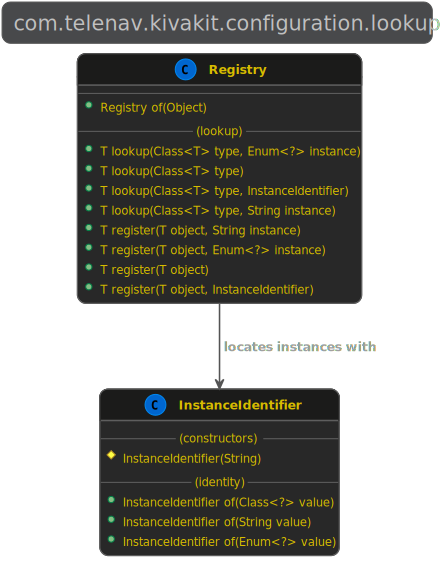
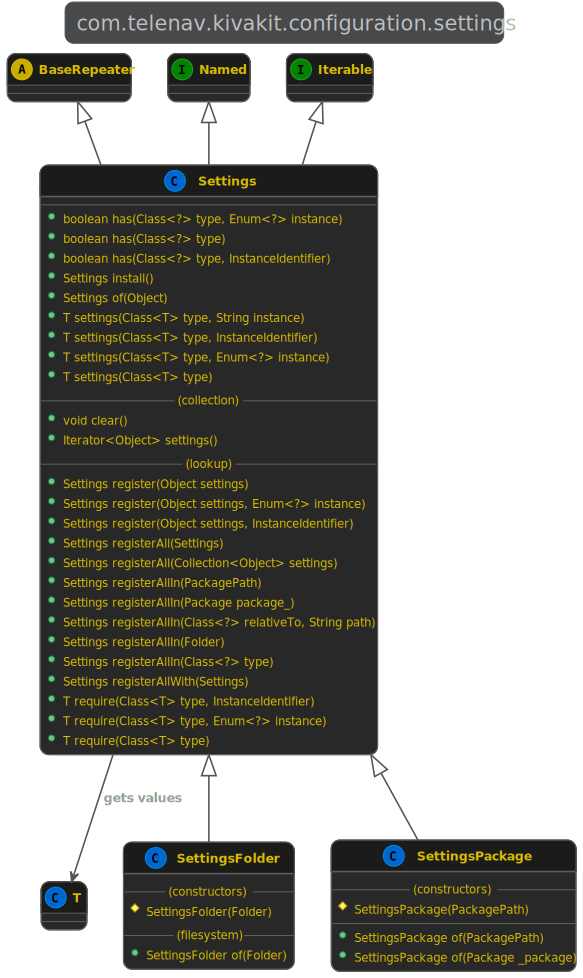
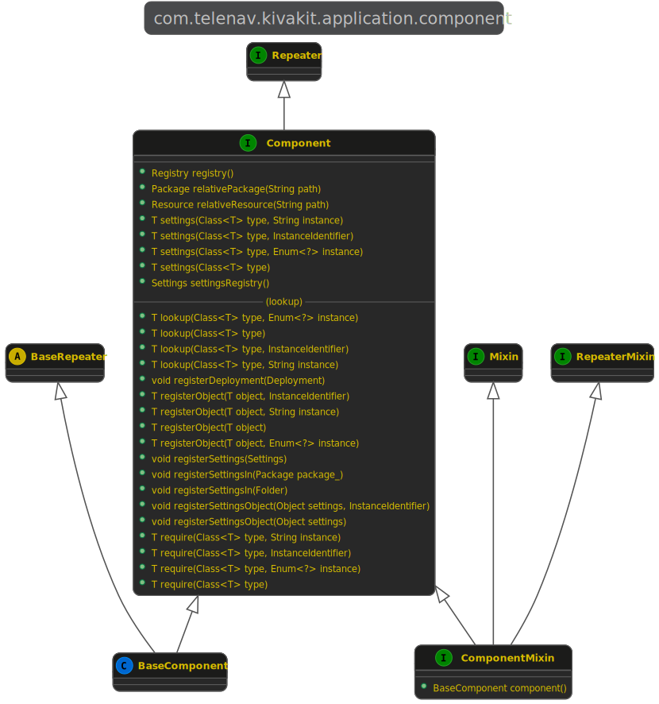

2021.08.02

### KivaKit components and settings &nbsp; 

The *kivakit-configuration* module provides two useful facilities for configuring and working with components:

1. An object lookup registry (*Registry*)
2. A settings registry (*Settings*)

The *kivakit-component* module provides a (very) lightweight base component class (*BaseComponent*) that makes it easy to define modular components that use this functionality as well as other common component-related functionality such as [*message broadcasting and listening*](broadcaster.md). In practice, it is easiest to simply use *BaseComponent* (or *ComponentMixin*) instead of directly interacting with the lookup and settings registries in *kivakit-configuration*.

 

#### The object lookup registry

The class *Registry* in *com.telenav.kivakit.configuration.lookup* can be used to register and look up ordinary Java objects. For a detailed examination of the design pattern used by *Registry* and its advantages, see [*Why KivaKit provides service locator instead of DI*](service-locator.md)</a>. 

&nbsp;&nbsp;&nbsp;&nbsp;&nbsp; 

The code to register an object with *Registry* looks like:

    Spaceship spaceship = [...]
    
    Registry.of(this).register(spaceship);

The *this* reference here will be used by KivaKit in the future to provide different lookup registries for different objects. For example, some objects might belong to one container with its own registry and other objects might belong to another container using a separate registry. When accessing a registry from a *static* method, *null* can be passed as the *this* reference to *Registry.of()* and the global registry will always be used.

&nbsp;&nbsp;&nbsp;&nbsp;&nbsp;&nbsp;&nbsp;&nbsp; 

Our *Spaceship* object can then be found with:

    var spaceship = Registry.of(this).lookup(Spaceship.class);

If there is more than one *Spaceship* in the registry, is becomes necessary to distinguish which one we want to register or lookup. We do this by passing a second parameter that identifies which instance we are referring to:

    enum ShipType { BATTLESHIP, ORBITER }
    
    Spaceship spaceship = [...]

    Registry.of(this).register(spaceship, ORBITER);
    
    [...]
    
    var orbiter = Registry.of(this).lookup(Spaceship.class, ORBITER);

 

#### The settings registry

The *Settings* class in *com.telenav.kivakit.configuration.settings*, and its subclasses *SettingsFolder* and *SettingsPackage* provide registries of user-defined settings objects. 

&nbsp;&nbsp;&nbsp;&nbsp;&nbsp; 

For example, this user-defined settings object might be used to configure *Apache Pinot*:

    public class PinotSettings
    {
        @KivaKitPropertyConverter(Port.Converter.class)
        Port zookeeperPort;
    
        @KivaKitPropertyConverter
        String clusterName;
    
        public Connection connection()
        {
            return ConnectionFactory.fromZookeeper(zookeeperPort + "/" + clusterName);
        }
    }

The *PinotSettings* object here specifies a port for *Apache Zookeeper*, and the name of an *Apache Pinot* cluster. These settings can be loaded from a *.properties* file in a *Folder* or a *Package*. The *.properties* file for *PinoSettings* looks like this:

    class         = com.telenav.scout.safety.demo.PinotSettings
    zookeeperPort = localhost:2181
    clusterName   = PinotCluster

The *class* value specifies the settings object to instantiate. Once the object is created, the *zookeeperPort* and *clusterName* values are converted to objects using the property converter specified (or implied by the field's type signature) by *@KivaKitPropertyConverter*. Those objects are then assigned to the appropriate fields of *PinotSettings*.

Packages and folders of *.properties* files can be used to group the settings for a particular configuration of an application or server (the *Deployment* and *DeploymentSet* classes help to do this and will be the subject of a future article). For example:

    settings
       ├── PinotSettings.properties
       ├── WebSettings.properties
       └── HdfsSettings.properties

To load all settings objects from a folder into the settings registry for *this* object, the *registerAllFrom()* method of *Settings* can be used like this:

    Settings.of(this).registerAllFrom(Folder.parse("settings"));

The *Settings.of()* method works in the same way as *Registry.of()*, as described above. Passing in the *this* reference of the object requesting a settings registry will allow different settings registries to be returned to different requesting objects in the future.

When multiple instances of the same settings class are required (for example, two *Apache Pinot* clusters each defined by *PinotSettings* objects), 
an *instance* property can be used to distinguish which instance is defined in each *.properties* file:

 

#### PinotCluster1.properties:

        class         = com.telenav.scout.safety.demo.PinotSettings
        instance      = CLUSTER1
        zookeeperPort = localhost:2181
        clusterName   = PinotCluster

 

#### PinotCluster2.properties:

        class         = com.telenav.scout.safety.demo.PinotSettings
        instance      = CLUSTER2
        zookeeperPort = localhost:2181
        clusterName   = PinotCluster

These configurations can then be found using an instance specifier as in:

    enum Cluster { CLUSTER1, CLUSTER2 }

    var cluster1 = Settings.of(this).lookup(PinotSettings.class, CLUSTER1);
    var cluster2 = Settings.of(this).lookup(PinotSettings.class, CLUSTER2);

 

#### KivaKit components

Now that we have covered the core mechanisms for registering and locating objects and settings, we can take a look at how KivaKit components make accessing this functionality easier. KivaKit components extend *BaseComponent*, which provides convenience methods for messaging, and for accessing objects from the lookup and settings registries for the component. In the event that a class already extends another base class, the *ComponentMixin* interface can be used instead (see [*How KivaKit adds mixins to Java*](mixins.md) for details).

&nbsp;&nbsp;&nbsp;&nbsp;&nbsp; 

Continuing with our Apache Pinot example from above, we can write a *Pinot* component which uses *PinoSettings* to get a connection to the specified Apache Pinot database cluster:

    public class Pinot extends BaseComponent
    {
        public List<ResultSet> query(String query, Object... arguments)
        {
            final var connection = require(PinotSettings.class).connection();
            
            [...]
        }
    }

Notice that *require(PinotSettings.class)* in *BaseComponent* returns a *PinotSettings* object which, as we saw earlier, has no getters or setters. Instead it provides a method, *connection()* for getting a *Connection* based on the settings. The result is a one liner that gets a connection to our Pinot cluster without breaking encapsulation:

    require(PinotSettings.class).connection()

Finally, the *Application* and *Server* classes in the *kivakit-application* module extend *BaseComponent*, which means that all applications are components and have convenient ways to perform messaging operations, and look up objects and settings. In fact, in our *Application*, we can register our settings like this:

    public MyPinotApplication extends Application
    {
        protected void onRun()
        {
            registerAllSettingsIn(Folder.parse("settings/development"));
            
            [...]
        }
    }
    
In this code, all *.properties* files in the settings folder *settings/development* will be loaded into the application's settings registry. Note that the names of *.properties* files do not have to correspond to the settings class that they instantiate (as above in *PinotCluster1.properties* and *PinotCluster2.properties*).

Once the settings are loaded, they can be queried by our *Pinot* component, as shown above. In our *Apache Pinot* example, we've shown how KivaKit's BaseComponent class (or *ComponentMixin* interface) makes it easy to register and locate settings objects. In the end, only one line was required to load all of the application's settings from *.properties* files (including *PinotSettings*):

    registerAllSettingsIn(Folder.parse("settings/development"));
            
and one further line was required to access an *Apache Pinot* database connection defined by *PinotSettings*:
            
    require(PinotSettings.class).connection()

 

#### Code 

The object and settings registries discussed above are available in *kivakit-configuration* in the [KivaKit](https://www.kivakit.org) project:

    <dependency>
        <groupId>com.telenav.kivakit</groupId>
        <artifactId>kivakit-configuration</artifactId>
        <version>${kivakit.version}</version>
    </dependency>

The component-related classes are available in *kivakit-component*:

    <dependency>
        <groupId>com.telenav.kivakit</groupId>
        <artifactId>kivakit-component</artifactId>
        <version>${kivakit.version}</version>
    </dependency>

 

Questions? Comments? Tweet yours to @OpenKivaKit or post here:

