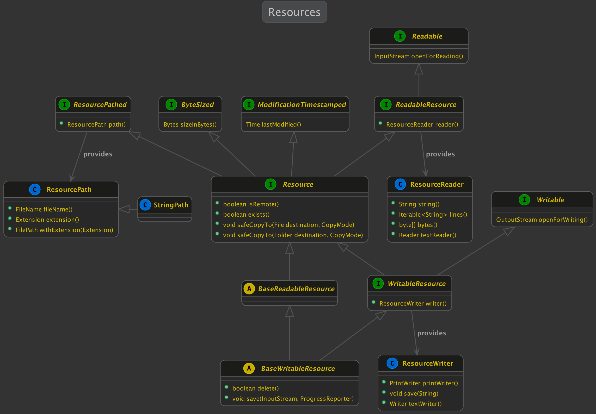
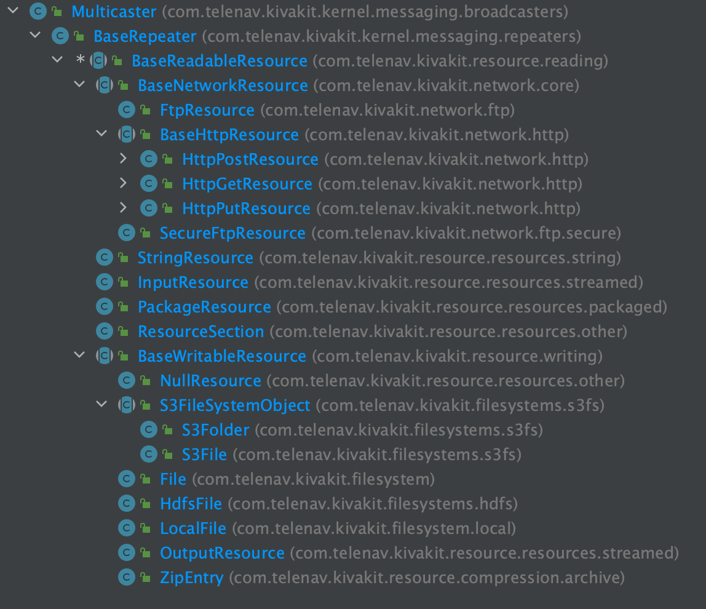

####  &nbsp; [2021.XX.XX - KivaKit resources](#resources)  

2021.XX.XX

### KivaKit resources &nbsp; 

A resource is a stream of data that can be opened, and then read from or written to. Examples of resources include:

* Files
* Sockets
* Zip or JAR file entries
* S3 objects
* Package resources
* HDFS files
* HTTP responses
* Input streams
* Output streams

KivaKit provides an abstraction that allows easy and consistent access to these resources and others, and it makes it easy to create new resources. Some short examples:

*Read the lines of a .csv file from a package, reporting progress:*

    var resource = PackageResource.of(getClass(), "target-planets.csv");
    try (var line : listenTo(new CsvReader(resource, schema, ',', reporter)).lines())
    {
        [...]
    }

*Write a string to a file on S3:*

    var file = File.parse("s3://mybucket/myobject.txt");    
    try (var out = listenTo(file).writer().printWriter())
    {
        out.println("Start Operation Impending Doom III in 10 seconds");
    }

*Safely extract an entry (ensuring no partial result) from a .zip file:*

    var file = File.parse("/users/jonathan/input.zip");
    var folder = Folder.parse("/users/jonathan");
    try (var zip = ZipArchive.open(file, reporter, READ))
    {
        listenTo(zip.entry("data.txt")).safeCopyTo(folder, OVERWRITE);
    }
    
In each case, the code is assumed to be in a class implementing *Repeater*. The *listenTo()* call connects the method's object to the argument object, creating a listener chain. If something interesting happened in the resource, it would broadcast a message to its listeners, and the example method's object would re-broadcast it to its listeners.

All *Resource*s use the *Broadcaster.fatal()* method to report problems with opening, reading and writing (other methods may have different semantics, such as those with a boolean return value). The *fatal()* method in *Broadcaster*'s base class *Transceiver* does this:

1. Broadcasts *FatalProblem* message to listeners
2. Throws *IllegalStateException*

The code (in *Broadcaster*'s parent interface *Transceiver*) looks like this:

    default <T> T fatal(final String text, final Object... arguments)
    {
        final var problem = new FatalProblem(text, arguments);
        handle(problem);
        problem.throwAsIllegalStateException();
        return null;
    }

*This design decouples the broadcasting of a *FatalProblem* message to listeners from the flow-of-control change that occurs as the result of throwing an exception*. The result is that, in most cases, exceptions can be caught only when an operation is recoverable, and the information in the exception can be ignored because it has already been broadcast.

For example, in this common(but unfortunate) idiom, error information is propagated to the caller with an exception that is caught, qualified with a cause and logged:

    class Launcher
    {
        void doDangerousStuff()
        {
            [...]
            
            throw new DangerousStuffException("Whoops.");
        }
    }
     
    class AttackPlanet
    {
        boolean prepareMissileLauncher()
        {
            try
            {
                doDangerousStuff();
                return true;
            }
            catch (DangerousStuffException e)
            {
                LOGGER.problem(e, "Unable to do dangerous stuff");
                return false;
            }
        }
    }

A KivaKit alternative is this:

    class Launcher extends BaseRepeater
    {
        void doDangerousStuff()
        {
            [...]
     
            fatal("Unable to do dangerous stuff: Whoops.");
        }
    }
    
    class AttackPlanet extends BaseRepeater
    {
        boolean prepareMissileLauncher()
        {    
            listenTo(new Launcher()).doDangerousStuff();
            return true;
        }
    }

After the *FatalProblem* message in *doDangerousStuff()* is broadcast by the *fatal()* method, the flow of control propagates separately via an *IllegalStateException* thrown by the same *fatal()* method to any caller on the call stack that might be able to substantially respond to the issue (as opposed to simply recording it). 

How do KivaKit resources work?

The design of KivaKit resources is [fairly complex](https://www.kivakit.org/0.9.8-beta/lexakai/kivakit/kivakit-resource/documentation/diagrams/diagram-resource.svg), so we will focus on the most important, high level aspects in this article.

A simplified UML diagram:

The *Resource* class in this diagram is central. This class:

* Has a *ResourcePath* (from *ResourcePathed*)
* Has a size in bytes (from *ByteSized*)
* Has a time of last modification (from *ModificationTimestamped*)
* Is a *ReadableResource*

Since all resources are *ReadableResource*s, they can be opened with *Readable.openForReading()* or read from with the convenience methods  *ResourceReader*.

In addition, some resources are *WritableResource*s. Those can be opened with *Writable.openForWriting()* and written to with the convenience class *ResourceWriter*

The *Resource* class itself can determine if the resource *exists()* and if it *isRemote()*. Remote resources can be *materialized* to the local filesystem before reading them (using methods not in the UML diagram). *Resource*s can perform a safe copy to a destination *File* or *Folder* with the two *safeCopyTo()* methods. Safe copying involves 3 steps:

1. Write to a temporary file
2. Delete the destination file
3. Rename the temporary file to the destination filename

Finally, *BaseWritableResource* extends *BaseReadableResource* to add the ability to *delete* a resource, and to save an *InputStream* to the resource, reporting progress as it does this. This is the class hierarchy for *ReadableResource*s and *WritableResource*s:

Notice that all resources are *Repeater*s (see [Broadcaster/Listener design pattern](#broadcaster)), which makes error handling easy and consistent. 

The implementation of a simple *ReadableResource* requires only an *onOpenForReading* method and a *sizeInBytes()* method. The *StringResource* class is a good example, and looks like this:

    public class StringResource extends BaseReadableResource
    {
        private final String value;
    
        public StringResource(final ResourcePath path, final String value)
        {
            super(path);
            this.value = value;
        }
    
        @Override
        public InputStream onOpenForReading()
        {
            return new StringInput(value);
        }
    
            @Override
        public Bytes sizeInBytes()
        {
            return Bytes.bytes(value.length());
        }
    }

A few things we didn't talk about (that will be covered in future articles):

* All resources transparently implement different kinds of compression and decompression via the *Codec* interface
* How the *ProgressReporter* interface works
* Resolution of generic resource identifiers
* Loading of SPI implementations used by File and Folder (Local, S3, HDFS, etc)

The resources covered above are available at [KivaKit](https://www.kivakit.org).

Questions? Comments? Tweet yours to @OpenKivaKit.
